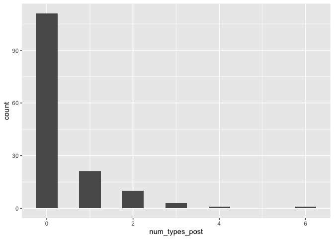

Score BABIES Life Stressor Checklist - Revised
================
Lucy S. King
2020

  - [Environment](#environment)
  - [Score Cross-Sectional LSC-R
    Data](#score-cross-sectional-lsc-r-data)
      - [(collected at infant age 6
        months)](#collected-at-infant-age-6-months)
      - [Read in data](#read-in-data)
      - [Lifetime stress: Cross-sectional
        data](#lifetime-stress-cross-sectional-data)
      - [Pregnancy stress: Cross-sectional
        data](#pregnancy-stress-cross-sectional-data)
      - [Preconception stress: Cross-sectional
        data](#preconception-stress-cross-sectional-data)
      - [Postnatal stress: Cross-sectional
        data](#postnatal-stress-cross-sectional-data)
      - [Childhood stress: Cross-sectional
        data](#childhood-stress-cross-sectional-data)
  - [Score Longitudinal LSC-R Data](#score-longitudinal-lsc-r-data)
      - [(collected during pregnancy and at infant age 6
        months)](#collected-during-pregnancy-and-at-infant-age-6-months)
      - [Read in data](#read-in-data-1)
      - [Lifetime stress: Longitudinal
        data](#lifetime-stress-longitudinal-data)
      - [Pregnancy stress: Longitudinal
        data](#pregnancy-stress-longitudinal-data)
      - [Preconception stress: Longitudinal
        data](#preconception-stress-longitudinal-data)
      - [Childhood stress: Longitudinal
        data](#childhood-stress-longitudinal-data)
      - [Postnatal stress: Longitudinal
        data](#postnatal-stress-longitudinal-data)
      - [Table of exposure counts](#table-of-exposure-counts)
  - [Psychometrics](#psychometrics)
      - [Calculate coder reliability](#calculate-coder-reliability)
      - [Calculate chronbach’s alpha for summed
        severity](#calculate-chronbachs-alpha-for-summed-severity)
  - [Combine and export data](#combine-and-export-data)
      - [Combine longitudinal data](#combine-longitudinal-data)
      - [Combine cross-sectional and longitudinal
        data](#combine-cross-sectional-and-longitudinal-data)
      - [Histograms](#histograms)
      - [Export](#export)

# Environment

``` r
library(tidyverse)
library(lubridate)
library(psych)
library(readxl)

home <- "~/Box/Mooddata_Coordinating/BABIES/Data/final_scored_data/LSCR/"
# cross-sectional data
cs_stress_file1 <- paste0(
  home, 
  "raw_data/cleaned_files/cs_LSCR_201811_6mo_rated_cleaned.xlsx"
)
cs_stress_file2 <- paste0(
  home, 
  "raw_data/cleaned_files/cs_LSCR_201904_6mo_rated_cleaned.xlsx"
)
cs_dob_file <- paste0(
  home,
  "raw_data/cs_dob.csv"
)
cs_visit_date_file <- paste0(
  home,
  "raw_data/cs_visit_date.csv"
)

# longitudinal data
lg_visit_date_file <- paste0(
  home,
  "raw_data/lg_visit_date.csv"
)
lg_stress_T1_file <- paste0(
  home, 
  "raw_data/cleaned_files/long_LSCR_201906_preg_rated_cleaned.xlsx"
)
lg_stress_T3_file <- paste0(
  home,
  "/raw_data/cleaned_files/long_LSCR_202002_6mo_rated_cleaned.xlsx"
)
```

# Score Cross-Sectional LSC-R Data

### (collected at infant age 6 months)

## Read in data

``` r
cs_data1 <-
  read_xlsx(cs_stress_file1) %>% 
  mutate(
    timepoint = "CX 6mo"
  ) %>% 
  select(
    -redcap_event_name:-lscr_file,
    -lscr_interviewer,
    -contains("date")
  )

cs_data2 <-
  read_xlsx(cs_stress_file2) %>% 
  mutate(
    timepoint = "CX 6mo"
  ) %>% 
  select(
    -redcap_event_name:-lscr_file,
    -lscr_interviewer,
    -contains("date")
  )

cs_data <- 
  bind_rows(cs_data1, cs_data2) %>% 
  left_join(
    read_csv(cs_dob_file),
    by = "record_id"
  ) %>% 
  left_join(
    read_csv(cs_visit_date_file) %>% 
      mutate(record_id = as.numeric(record_id)),
    by = "record_id"
  ) %>% 
  rename(
    ID = record_id
  )
```

## Lifetime stress: Cross-sectional data

``` r
exp_vars <- 
  cs_data %>% 
  select(contains("preg")) %>% 
  names() %>% 
  str_replace("_preg", "") 

sev_vars <- 
  cs_data %>% 
  select(contains("sev_con")) %>% 
  names()

sub_sev_vars <-
  cs_data %>% 
  select(contains("_sev")) %>% 
  names()
```

``` r
cs_data <-
  cs_data %>% 
  filter(!is.na(lscr_disas)) %>% 
  mutate_at(
    vars(exp_vars),
    as.integer
  ) %>% 
  mutate_at(
    vars(sev_vars),
    as.double
  ) %>% 
  mutate_at(
    vars(sub_sev_vars),
    as.double
  ) %>% 
  mutate(
    num_types = pmap_int(
      select(., exp_vars),
      function(...) sum(c(...), na.rm = TRUE)
    ),
    sum_sev = pmap_dbl(
      select(., sev_vars),
      function(...) sum(c(...), na.rm = TRUE)
    ),
    max_sev = pmap_dbl(
      select(., sev_vars),
      function(...) max(c(...), na.rm = TRUE)
    ),
    sum_sub_sev = pmap_dbl(
      select(., sub_sev_vars),
      function(...) sum(c(...), na.rm = TRUE)
    ),
    max_sub_sev = pmap_dbl(
      select(., sub_sev_vars),
      function(...) max(c(...), na.rm = TRUE)
    )
  ) %>% 
  mutate(
   max_sev = if_else(
      max_sev == -Inf,
      0, max_sev
    ),
   max_sub_sev = if_else(
      max_sub_sev == -Inf,
      0, max_sub_sev
    )
  )
```

## Pregnancy stress: Cross-sectional data

``` r
cs_data <-
  cs_data %>% 
  mutate_at(
    vars(mom_dob, baby_dob, baby_due_date, visit_date),
    list(~parse_date_time2(., "mdy"))
  ) %>% 
  mutate(
    mom_age_lsc6mo = (mom_dob %--% visit_date) / years(1),
    mom_age_birth = (mom_dob %--% baby_dob) / years(1),
    conception_date = baby_due_date - weeks(38),
    mom_age_concept = ((mom_dob %--% conception_date) / years(1)) 
  )
```

``` r
pregnancy_exp <- function(data, age, age_exp, preg_exp) {
  age <- enquo(age)
  age_exp <- enquo(age_exp)
  preg_exp <- enquo(preg_exp)
  var_name <- paste0(quo_name(exp), "_preg")
  
  data %>% 
    mutate(
      !!var_name :=
        if_else(
          !!age_exp >= !!age & (!!preg_exp == 1),
          1, 0
        )
    )
}
```

``` r
cs_data <-
  cs_data %>% 
  pregnancy_exp(mom_age_concept, lscr_disas_age_off, lscr_disas_preg) %>% 
  pregnancy_exp(mom_age_concept, lscr_acc_age_off, lscr_acc_preg) %>% 
  pregnancy_exp(mom_age_concept, lscr_witacc_age_off, lscr_witacc_preg) %>% 
  pregnancy_exp(mom_age_concept, lscr_famjail_age_off, lscr_famjail_preg) %>%
  pregnancy_exp(mom_age_concept, lscr_jail_age_off, lscr_jail_preg) %>% 
  pregnancy_exp(mom_age_concept, lscr_adopt_age_off, lscr_adopt_preg) %>% 
  pregnancy_exp(mom_age_concept, lscr_pardivorce_age_off, lscr_pardivorce_preg) %>% 
  pregnancy_exp(mom_age_concept, lscr_divorce_age_off, lscr_divorce_preg) %>% 
  pregnancy_exp(mom_age_concept, lscr_money_age_off, lscr_money_preg) %>% 
  pregnancy_exp(mom_age_concept, lscr_ill_age_off, lscr_ill_preg) %>% 
  pregnancy_exp(mom_age_concept, lscr_emoab_age_off, lscr_emoab_preg) %>% 
  pregnancy_exp(mom_age_concept, lscr_physneg_age_off, lscr_physneg_preg) %>% 
  pregnancy_exp(mom_age_concept, lscr_abort_age_off, lscr_abort_preg) %>% 
  pregnancy_exp(mom_age_concept, lscr_sepchild_age_off, lscr_sepchild_preg) %>% 
  pregnancy_exp(mom_age_concept, lscr_care_age_off, lscr_care_preg) %>% 
  pregnancy_exp(mom_age_concept, lscr_death1_age_off, lscr_death1_preg) %>% 
  pregnancy_exp(mom_age_concept, lscr_death2_age_off, lscr_death2_preg) %>% 
  pregnancy_exp(mom_age_concept, lscr_famviol_age_off, lscr_famviol_preg) %>% 
  pregnancy_exp(mom_age_concept, lscr_witmug_age_off, lscr_witmug_preg) %>% 
  pregnancy_exp(mom_age_concept, lscr_mug_age_off, lscr_mug_preg) %>% 
  pregnancy_exp(mom_age_concept, lscr_physab_age_off, lscr_physab_preg) %>% 
  pregnancy_exp(mom_age_concept, lscr_domviol_age_off, lscr_domviol_preg) %>% 
  pregnancy_exp(mom_age_concept, lscr_sexharas_age_off, lscr_sexharas_preg) %>% 
  pregnancy_exp(mom_age_concept, lscr_sextouch1_age_off, lscr_sextouch1_preg) %>% 
  pregnancy_exp(mom_age_concept, lscr_sextouch2_age_off, lscr_sextouch2_preg) %>% 
  pregnancy_exp(mom_age_concept, lscr_rape1_age_off, lscr_rape1_preg) %>% 
  pregnancy_exp(mom_age_concept, lscr_rape2_age_off, lscr_rape2_preg) %>% 
  pregnancy_exp(mom_age_concept, lscr_other1_age_off, lscr_other1_preg) %>% 
  pregnancy_exp(mom_age_concept, lscr_other2_age_off, lscr_other2_preg) %>% 
  pregnancy_exp(mom_age_concept, lscr_other3_age_off, lscr_other3_preg) %>% 
  dplyr::select(-`.Primitive(\"exp\")_preg`)
```

``` r
preg_exp_vars <- 
  cs_data %>% 
  select(contains("preg")) %>% 
  names()

calc_stage_sev <- function(stage_exp, sev) { #pregnancy
  case_when(
    stage_exp == 1 ~ sev,
    stage_exp == 0 ~ NA_real_,
    is.na(stage_exp) ~ NA_real_
  )
}
```

``` r
cs_data <-
  cs_data %>% 
  mutate_at(
    vars(preg_exp_vars),
    as.integer
  ) %>% 
  mutate(
    #objective
    sev_preg_disas = calc_stage_sev(lscr_disas_preg, sev_con_disas),
    sev_preg_witacc = calc_stage_sev(lscr_witacc_preg, sev_con_witacc),
    sev_preg_acc = calc_stage_sev(lscr_acc_preg, sev_con_acc),
    sev_preg_famjail = calc_stage_sev(lscr_famjail_preg, sev_con_famjail),
    sev_preg_jail = calc_stage_sev(lscr_jail_preg, sev_con_jail),
    sev_preg_adopt = calc_stage_sev(lscr_adopt_preg, sev_con_adopt),
    sev_preg_pardivorce = calc_stage_sev(lscr_pardivorce_preg, sev_con_pardivorce),
    sev_preg_divorce = calc_stage_sev(lscr_divorce_preg, sev_con_divorce),
    sev_preg_money = calc_stage_sev(lscr_money_preg, sev_con_money),
    sev_preg_ill = calc_stage_sev(lscr_ill_preg, sev_con_ill),
    sev_preg_emoab = calc_stage_sev(lscr_emoab_preg, sev_con_emoab),
    sev_preg_physneg = calc_stage_sev(lscr_physneg_preg, sev_con_physneg),
    sev_preg_abort = calc_stage_sev(lscr_abort_preg, sev_con_abort),
    sev_preg_sepchild = calc_stage_sev(lscr_sepchild_preg, sev_con_sepchild),
    sev_preg_care = calc_stage_sev(lscr_care_preg, sev_con_care),
    sev_preg_death1 = calc_stage_sev(lscr_death1_preg, sev_con_death1),
    sev_preg_death2 = calc_stage_sev(lscr_death2_preg, sev_con_death2),
    sev_preg_famviol = calc_stage_sev(lscr_famviol_preg, sev_con_famviol),
    sev_preg_witmug = calc_stage_sev(lscr_witmug_preg, sev_con_witmug),
    sev_preg_mug = calc_stage_sev(lscr_mug_preg, sev_con_mug),
    sev_preg_physab = calc_stage_sev(lscr_physab_preg, sev_con_physab),
    sev_preg_domviol = calc_stage_sev(lscr_domviol_preg, sev_con_domviol),
    sev_preg_sexharas = calc_stage_sev(lscr_sexharas_preg, sev_con_sexharas),
    sev_preg_sextouch1 = calc_stage_sev(lscr_sextouch1_preg, sev_con_sextouch1),
    sev_preg_sextouch2 = calc_stage_sev(lscr_sextouch2_preg, sev_con_sextouch2),
    sev_preg_rape1 = calc_stage_sev(lscr_rape1_preg, sev_con_rape1),
    sev_preg_rape2 = calc_stage_sev(lscr_rape2_preg, sev_con_rape2),
    sev_preg_other1 = calc_stage_sev(lscr_other1_preg, sev_con_other1),
    sev_preg_other2 = calc_stage_sev(lscr_other2_preg, sev_con_other2),
    sev_preg_other3 = calc_stage_sev(lscr_other2_preg, sev_con_other3)
)

cs_data <-
  cs_data %>% 
  mutate(
    #subjective
    sub_sev_preg_disas = calc_stage_sev(lscr_disas_preg, lscr_disas_sev),
    sub_sev_preg_witacc = calc_stage_sev(lscr_witacc_preg, lscr_witacc_sev),
    sub_sev_preg_acc = calc_stage_sev(lscr_acc_preg, lscr_acc_sev),
    sub_sev_preg_famjail = calc_stage_sev(lscr_famjail_preg, lscr_famjail_sev),
    sub_sev_preg_jail = calc_stage_sev(lscr_jail_preg, lscr_jail_sev),
    sub_sev_preg_adopt = calc_stage_sev(lscr_adopt_preg, lscr_adopt_sev),
    sub_sev_preg_pardivorce = calc_stage_sev(lscr_pardivorce_preg, lscr_pardivorce_sev),
    sub_sev_preg_divorce = calc_stage_sev(lscr_divorce_preg, lscr_divorce_sev),
    sub_sev_preg_money = calc_stage_sev(lscr_money_preg, lscr_money_sev),
    sub_sev_preg_ill = calc_stage_sev(lscr_ill_preg, lscr_ill_sev),
    sub_sev_preg_emoab = calc_stage_sev(lscr_emoab_preg, lscr_emoab_sev),
    sub_sev_preg_physneg = calc_stage_sev(lscr_physneg_preg, lscr_physneg_sev),
    sub_sev_preg_abort = calc_stage_sev(lscr_abort_preg, lscr_abort_sev),
    sub_sev_preg_sepchild = calc_stage_sev(lscr_sepchild_preg, lscr_sepchild_sev),
    sub_sev_preg_care = calc_stage_sev(lscr_care_preg, lscr_care_sev),
    sub_sev_preg_death1 = calc_stage_sev(lscr_death1_preg, lscr_death1_sev),
    sub_sev_preg_death2 = calc_stage_sev(lscr_death2_preg, lscr_death2_sev),
    sub_sev_preg_famviol = calc_stage_sev(lscr_famviol_preg, lscr_famviol_sev),
    sub_sev_preg_witmug = calc_stage_sev(lscr_witmug_preg, lscr_witmug_sev),
    sub_sev_preg_mug = calc_stage_sev(lscr_mug_preg, lscr_mug_sev),
    sub_sev_preg_physab = calc_stage_sev(lscr_physab_preg, lscr_physab_sev),
    sub_sev_preg_domviol = calc_stage_sev(lscr_domviol_preg, lscr_domviol_sev),
    sub_sev_preg_sexharas = calc_stage_sev(lscr_sexharas_preg, lscr_sexharas_sev),
    sub_sev_preg_sextouch1 = calc_stage_sev(lscr_sextouch1_preg, lscr_sextouch1_sev),
    sub_sev_preg_sextouch2 = calc_stage_sev(lscr_sextouch2_preg, lscr_sextouch2_sev),
    sub_sev_preg_rape1 = calc_stage_sev(lscr_rape1_preg, lscr_rape1_sev),
    sub_sev_preg_rape2 = calc_stage_sev(lscr_rape2_preg, lscr_rape2_sev),
    sub_sev_preg_other1 = calc_stage_sev(lscr_other1_preg, lscr_other1_sev),
    sub_sev_preg_other2 = calc_stage_sev(lscr_other2_preg, lscr_other2_sev),
    sub_sev_preg_other3 = calc_stage_sev(lscr_other3_preg, lscr_other3_sev)
  ) 
```

``` r
preg_sev_vars <-
  cs_data %>% 
  select(contains("sev_preg")) %>% 
  names() %>% 
  str_replace("sub_", "") 

preg_sub_sev_vars <-
  cs_data %>% 
  select(contains("sub_sev_preg")) %>% 
  names() 
```

``` r
cs_data <-
  cs_data %>% 
  mutate(
    num_types_preg = pmap_int(
      select(., preg_exp_vars),
      function(...) sum(c(...), na.rm = TRUE)
    ),
    sum_sev_preg = pmap_dbl(
      select(., preg_sev_vars),
      function(...) sum(c(...), na.rm = TRUE)
    ),
    max_sev_preg =  pmap_dbl(
      select(., preg_sev_vars),
      function(...) max(c(...), na.rm = TRUE)
    ),
    sum_sub_sev_preg = pmap_dbl(
      select(., preg_sub_sev_vars),
      function(...) sum(c(...), na.rm = TRUE)
    ),
    max_sub_sev_preg =  pmap_dbl(
      select(., preg_sub_sev_vars),
      function(...) max(c(...), na.rm = TRUE)
    ),
    max_sev_preg = if_else(
      max_sev_preg == -Inf,
      0, max_sev_preg
    ),
    max_sub_sev_preg = if_else(
      max_sev_preg == -Inf,
      0, max_sev_preg
    )
  )
```

## Preconception stress: Cross-sectional data

``` r
preconception_exp <- function(data, age, exp, age_exp, preg_exp) {
  age <- enquo(age)
  exp <- enquo(exp)
  age_exp <- enquo(age_exp)
  preg_exp <- enquo(preg_exp)
  var_name <- paste0(quo_name(exp), "_prec")
  
  data %>% 
    mutate(
      !! var_name :=
        if_else(
          !!age_exp <= !!age & (!!preg_exp == 0 | is.na(!!preg_exp)),
          1, 0
        )
    )
}
```

``` r
cs_data <-
  cs_data %>% 
  preconception_exp(mom_age_concept, lscr_disas, lscr_disas_age_off, lscr_disas_preg) %>% 
  preconception_exp(mom_age_concept, lscr_acc, lscr_acc_age_off, lscr_acc_preg) %>% 
  preconception_exp(mom_age_concept, lscr_witacc, lscr_witacc_age_off, lscr_witacc_preg) %>% 
  preconception_exp(mom_age_concept, lscr_famjail, lscr_famjail_age_off, lscr_famjail_preg) %>%
  preconception_exp(mom_age_concept, lscr_jail, lscr_jail_age_off, lscr_jail_preg) %>% 
  preconception_exp(mom_age_concept, lscr_adopt, lscr_adopt_age_off, lscr_adopt_preg) %>% 
  preconception_exp(mom_age_concept, lscr_pardivorce, lscr_pardivorce_age_off, lscr_pardivorce_preg) %>% 
  preconception_exp(mom_age_concept, lscr_divorce, lscr_divorce_age_off, lscr_divorce_preg) %>% 
  preconception_exp(mom_age_concept, lscr_money, lscr_money_age_off, lscr_money_preg) %>% 
  preconception_exp(mom_age_concept, lscr_ill, lscr_ill_age_off, lscr_ill_preg) %>% 
  preconception_exp(mom_age_concept, lscr_emoab, lscr_emoab_age_off, lscr_emoab_preg) %>% 
  preconception_exp(mom_age_concept, lscr_physneg, lscr_physneg_age_off, lscr_physneg_preg) %>% 
  preconception_exp(mom_age_concept, lscr_abort, lscr_abort_age_off, lscr_abort_preg) %>% 
  preconception_exp(mom_age_concept, lscr_sepchild, lscr_sepchild_age_off, lscr_sepchild_preg) %>% 
  preconception_exp(mom_age_concept, lscr_care, lscr_care_age_off, lscr_care_preg) %>% 
  preconception_exp(mom_age_concept, lscr_death1, lscr_death1_age_off, lscr_death1_preg) %>% 
  preconception_exp(mom_age_concept, lscr_death2, lscr_death2_age_off, lscr_death2_preg) %>% 
  preconception_exp(mom_age_concept, lscr_famviol, lscr_famviol_age_off, lscr_famviol_preg) %>% 
  preconception_exp(mom_age_concept, lscr_witmug, lscr_witmug_age_off, lscr_witmug_preg) %>% 
  preconception_exp(mom_age_concept, lscr_mug, lscr_mug_age_off, lscr_mug_preg) %>% 
  preconception_exp(mom_age_concept, lscr_physab, lscr_physab_age_off, lscr_physab_preg) %>% 
  preconception_exp(mom_age_concept, lscr_domviol, lscr_domviol_age_off, lscr_domviol_preg) %>% 
  preconception_exp(mom_age_concept, lscr_sexharas, lscr_sexharas_age_off, lscr_sexharas_preg) %>% 
  preconception_exp(mom_age_concept, lscr_sextouch1, lscr_sextouch1_age_off, lscr_sextouch1_preg) %>% 
  preconception_exp(mom_age_concept, lscr_sextouch2, lscr_sextouch2_age_off, lscr_sextouch2_preg) %>% 
  preconception_exp(mom_age_concept, lscr_rape1, lscr_rape1_age_off, lscr_rape1_preg) %>% 
  preconception_exp(mom_age_concept, lscr_rape2, lscr_rape2_age_off, lscr_rape2_preg) %>% 
  preconception_exp(mom_age_concept, lscr_other1, lscr_other1_age_off, lscr_other1_preg) %>% 
  preconception_exp(mom_age_concept, lscr_other2, lscr_other2_age_off, lscr_other2_preg) %>% 
  preconception_exp(mom_age_concept, lscr_other3, lscr_other3_age_off, lscr_other3_preg)
```

``` r
prec_exp_vars <-
  cs_data %>% 
  select(contains("prec")) %>% 
  names()
```

``` r
cs_data <-
  cs_data %>% 
  mutate_at(
    vars(prec_exp_vars),
    as.integer
  ) %>% 
  mutate(
    #objective
    sev_prec_disas = calc_stage_sev(lscr_disas_prec, sev_con_disas),
    sev_prec_witacc = calc_stage_sev(lscr_witacc_prec, sev_con_witacc),
    sev_prec_acc = calc_stage_sev(lscr_acc_prec, sev_con_acc),
    sev_prec_famjail = calc_stage_sev(lscr_famjail_prec, sev_con_famjail),
    sev_prec_jail = calc_stage_sev(lscr_jail_prec, sev_con_jail),
    sev_prec_adopt = calc_stage_sev(lscr_adopt_prec, sev_con_adopt),
    sev_prec_pardivorce = calc_stage_sev(lscr_pardivorce_prec, sev_con_pardivorce),
    sev_prec_divorce = calc_stage_sev(lscr_divorce_prec, sev_con_divorce),
    sev_prec_money = calc_stage_sev(lscr_money_prec, sev_con_money),
    sev_prec_ill = calc_stage_sev(lscr_ill_prec, sev_con_ill),
    sev_prec_emoab = calc_stage_sev(lscr_emoab_prec, sev_con_emoab),
    sev_prec_physneg = calc_stage_sev(lscr_physneg_prec, sev_con_physneg),
    sev_prec_abort = calc_stage_sev(lscr_abort_prec, sev_con_abort),
    sev_prec_sepchild = calc_stage_sev(lscr_sepchild_prec, sev_con_sepchild),
    sev_prec_care = calc_stage_sev(lscr_care_prec, sev_con_care),
    sev_prec_death1 = calc_stage_sev(lscr_death1_prec, sev_con_death1),
    sev_prec_death2 = calc_stage_sev(lscr_death2_prec, sev_con_death2),
    sev_prec_famviol = calc_stage_sev(lscr_famviol_prec, sev_con_famviol),
    sev_prec_witmug = calc_stage_sev(lscr_witmug_prec, sev_con_witmug),
    sev_prec_mug = calc_stage_sev(lscr_mug_prec, sev_con_mug),
    sev_prec_physab = calc_stage_sev(lscr_physab_prec, sev_con_physab),
    sev_prec_domviol = calc_stage_sev(lscr_domviol_prec, sev_con_domviol),
    sev_prec_sexharas = calc_stage_sev(lscr_sexharas_prec, sev_con_sexharas),
    sev_prec_sextouch1 = calc_stage_sev(lscr_sextouch1_prec, sev_con_sextouch1),
    sev_prec_sextouch2 = calc_stage_sev(lscr_sextouch2_prec, sev_con_sextouch2),
    sev_prec_rape1 = calc_stage_sev(lscr_rape1_prec, sev_con_rape1),
    sev_prec_rape2 = calc_stage_sev(lscr_rape2_prec, sev_con_rape2),
    sev_prec_other1 = calc_stage_sev(lscr_other1_prec, sev_con_other1),
    sev_prec_other2 = calc_stage_sev(lscr_other2_prec, sev_con_other2),
    sev_prec_other3 = calc_stage_sev(lscr_other2_prec, sev_con_other3)
  )

cs_data <-
  cs_data %>% 
  mutate(
    #subjective
    sub_sev_prec_disas = calc_stage_sev(lscr_disas_prec, lscr_disas_sev),
    sub_sev_prec_witacc = calc_stage_sev(lscr_witacc_prec, lscr_witacc_sev),
    sub_sev_prec_acc = calc_stage_sev(lscr_acc_prec, lscr_acc_sev),
    sub_sev_prec_famjail = calc_stage_sev(lscr_famjail_prec, lscr_famjail_sev),
    sub_sev_prec_jail = calc_stage_sev(lscr_jail_prec, lscr_jail_sev),
    sub_sev_prec_adopt = calc_stage_sev(lscr_adopt_prec, lscr_adopt_sev),
    sub_sev_prec_pardivorce = calc_stage_sev(lscr_pardivorce_prec, lscr_pardivorce_sev),
    sub_sev_prec_divorce = calc_stage_sev(lscr_divorce_prec, lscr_divorce_sev),
    sub_sev_prec_money = calc_stage_sev(lscr_money_prec, lscr_money_sev),
    sub_sev_prec_ill = calc_stage_sev(lscr_ill_prec, lscr_ill_sev),
    sub_sev_prec_emoab = calc_stage_sev(lscr_emoab_prec, lscr_emoab_sev),
    sub_sev_prec_physneg = calc_stage_sev(lscr_physneg_prec, lscr_physneg_sev),
    sub_sev_prec_abort = calc_stage_sev(lscr_abort_prec, lscr_abort_sev),
    sub_sev_prec_sepchild = calc_stage_sev(lscr_sepchild_prec, lscr_sepchild_sev),
    sub_sev_prec_care = calc_stage_sev(lscr_care_prec, lscr_care_sev),
    sub_sev_prec_death1 = calc_stage_sev(lscr_death1_prec, lscr_death1_sev),
    sub_sev_prec_death2 = calc_stage_sev(lscr_death2_prec, lscr_death2_sev),
    sub_sev_prec_famviol = calc_stage_sev(lscr_famviol_prec, lscr_famviol_sev),
    sub_sev_prec_witmug = calc_stage_sev(lscr_witmug_prec, lscr_witmug_sev),
    sub_sev_prec_mug = calc_stage_sev(lscr_mug_prec, lscr_mug_sev),
    sub_sev_prec_physab = calc_stage_sev(lscr_physab_prec, lscr_physab_sev),
    sub_sev_prec_domviol = calc_stage_sev(lscr_domviol_prec, lscr_domviol_sev),
    sub_sev_prec_sexharas = calc_stage_sev(lscr_sexharas_prec, lscr_sexharas_sev),
    sub_sev_prec_sextouch1 = calc_stage_sev(lscr_sextouch1_prec, lscr_sextouch1_sev),
    sub_sev_prec_sextouch2 = calc_stage_sev(lscr_sextouch2_prec, lscr_sextouch2_sev),
    sub_sev_prec_rape1 = calc_stage_sev(lscr_rape1_prec, lscr_rape1_sev),
    sub_sev_prec_rape2 = calc_stage_sev(lscr_rape2_prec, lscr_rape2_sev),
    sub_sev_prec_other1 = calc_stage_sev(lscr_other1_prec, lscr_other1_sev),
    sub_sev_prec_other2 = calc_stage_sev(lscr_other2_prec, lscr_other2_sev),
    sub_sev_prec_other3 = calc_stage_sev(lscr_other3_prec, lscr_other3_sev)
  ) 
```

``` r
prec_sev_vars <-
  cs_data %>% 
  select(contains("sev_prec")) %>% 
  names() %>% 
  str_replace("sub_", "") 

prec_sub_sev_vars <-
  cs_data %>% 
  select(contains("sub_sev_prec")) %>% 
  names() 
```

``` r
cs_data <-
  cs_data %>% 
  mutate(
    num_types_prec = pmap_int(
      select(., prec_exp_vars),
      function(...) sum(c(...), na.rm = TRUE)
    ),
    sum_sev_prec = pmap_dbl(
      select(., prec_sev_vars),
      function(...) sum(c(...), na.rm = TRUE)
    ),
    max_sev_prec =  pmap_dbl(
      select(., prec_sev_vars),
      function(...) max(c(...), na.rm = TRUE)
    ),
    sum_sub_sev_prec = pmap_dbl(
      select(., prec_sub_sev_vars),
      function(...) sum(c(...), na.rm = TRUE)
    ),
    max_sub_sev_prec =  pmap_dbl(
      select(., prec_sub_sev_vars),
      function(...) max(c(...), na.rm = TRUE)
    ),
    max_sev_prec = if_else(
      max_sev_prec == -Inf,
      0, max_sev_prec
    ),
    max_sub_sev_prec = if_else(
      max_sev_prec == -Inf,
      0, max_sev_prec
    )
  )
```

## Postnatal stress: Cross-sectional data

``` r
postnatal_exp <- function(data, age, exp, age_exp, preg_exp) {
  age <- enquo(age)
  exp <- enquo(exp)
  age_exp <- enquo(age_exp)
  preg_exp <- enquo(preg_exp)
  var_name <- paste0(quo_name(exp), "_post")
  
                     
  data %>% 
    mutate(
      !! var_name :=
        if_else(
          !!age_exp >= !!age & (!!preg_exp == 0 | is.na(!!preg_exp)),
          1, 0
        )
    )
}
```

``` r
cs_data <-
  cs_data %>% 
  postnatal_exp(mom_age_birth, lscr_disas, lscr_disas_age_off, lscr_disas_preg) %>% 
  postnatal_exp(mom_age_birth, lscr_acc, lscr_acc_age_off, lscr_acc_preg) %>% 
  postnatal_exp(mom_age_birth, lscr_witacc, lscr_witacc_age_off, lscr_witacc_preg) %>% 
  postnatal_exp(mom_age_birth, lscr_famjail, lscr_famjail_age_off, lscr_famjail_preg) %>%
  postnatal_exp(mom_age_birth, lscr_jail, lscr_jail_age_off, lscr_jail_preg) %>% 
  postnatal_exp(mom_age_birth, lscr_adopt, lscr_adopt_age_off, lscr_adopt_preg) %>% 
  postnatal_exp(mom_age_birth, lscr_pardivorce, lscr_pardivorce_age_off, lscr_pardivorce_preg) %>% 
  postnatal_exp(mom_age_birth, lscr_divorce, lscr_divorce_age_off, lscr_divorce_preg) %>% 
  postnatal_exp(mom_age_birth, lscr_money, lscr_money_age_off, lscr_money_preg) %>% 
  postnatal_exp(mom_age_birth, lscr_ill, lscr_ill_age_off, lscr_ill_preg) %>% 
  postnatal_exp(mom_age_birth, lscr_emoab, lscr_emoab_age_off, lscr_emoab_preg) %>% 
  postnatal_exp(mom_age_birth, lscr_physneg, lscr_physneg_age_off, lscr_physneg_preg) %>% 
  postnatal_exp(mom_age_birth, lscr_abort, lscr_abort_age_off, lscr_abort_preg) %>% 
  postnatal_exp(mom_age_birth, lscr_sepchild, lscr_sepchild_age_off, lscr_sepchild_preg) %>% 
  postnatal_exp(mom_age_birth, lscr_care, lscr_care_age_off, lscr_care_preg) %>% 
  postnatal_exp(mom_age_birth, lscr_death1, lscr_death1_age_off, lscr_death1_preg) %>% 
  postnatal_exp(mom_age_birth, lscr_death2, lscr_death2_age_off, lscr_death2_preg) %>% 
  postnatal_exp(mom_age_birth, lscr_famviol, lscr_famviol_age_off, lscr_famviol_preg) %>% 
  postnatal_exp(mom_age_birth, lscr_witmug, lscr_witmug_age_off, lscr_witmug_preg) %>% 
  postnatal_exp(mom_age_birth, lscr_mug, lscr_mug_age_off, lscr_mug_preg) %>% 
  postnatal_exp(mom_age_birth, lscr_physab, lscr_physab_age_off, lscr_physab_preg) %>% 
  postnatal_exp(mom_age_birth, lscr_domviol, lscr_domviol_age_off, lscr_domviol_preg) %>% 
  postnatal_exp(mom_age_birth, lscr_sexharas, lscr_sexharas_age_off, lscr_sexharas_preg) %>% 
  postnatal_exp(mom_age_birth, lscr_sextouch1, lscr_sextouch1_age_off, lscr_sextouch1_preg) %>% 
  postnatal_exp(mom_age_birth, lscr_sextouch2, lscr_sextouch2_age_off, lscr_sextouch2_preg) %>% 
  postnatal_exp(mom_age_birth, lscr_rape1, lscr_rape1_age_off, lscr_rape1_preg) %>% 
  postnatal_exp(mom_age_birth, lscr_rape2, lscr_rape2_age_off, lscr_rape2_preg) %>% 
  postnatal_exp(mom_age_birth, lscr_other1, lscr_other1_age_off, lscr_other1_preg) %>% 
  postnatal_exp(mom_age_birth, lscr_other2, lscr_other2_age_off, lscr_other2_preg) %>% 
  postnatal_exp(mom_age_birth, lscr_other3, lscr_other3_age_off, lscr_other3_preg)
```

``` r
post_exp_vars <-
  cs_data %>% 
  select(contains("post")) %>% 
  names()
```

``` r
cs_data <-
  cs_data %>% 
  mutate_at(
    vars(post_exp_vars),
    as.integer
  ) %>% 
  mutate(
    #objective
    sev_post_disas = calc_stage_sev(lscr_disas_post, sev_con_disas),
    sev_post_witacc = calc_stage_sev(lscr_witacc_post, sev_con_witacc),
    sev_post_acc = calc_stage_sev(lscr_acc_post, sev_con_acc),
    sev_post_famjail = calc_stage_sev(lscr_famjail_post, sev_con_famjail),
    sev_post_jail = calc_stage_sev(lscr_jail_post, sev_con_jail),
    sev_post_adopt = calc_stage_sev(lscr_adopt_post, sev_con_adopt),
    sev_post_pardivorce = calc_stage_sev(lscr_pardivorce_post, sev_con_pardivorce),
    sev_post_divorce = calc_stage_sev(lscr_divorce_post, sev_con_divorce),
    sev_post_money = calc_stage_sev(lscr_money_post, sev_con_money),
    sev_post_ill = calc_stage_sev(lscr_ill_post, sev_con_ill),
    sev_post_emoab = calc_stage_sev(lscr_emoab_post, sev_con_emoab),
    sev_post_physneg = calc_stage_sev(lscr_physneg_post, sev_con_physneg),
    sev_post_abort = calc_stage_sev(lscr_abort_post, sev_con_abort),
    sev_post_sepchild = calc_stage_sev(lscr_sepchild_post, sev_con_sepchild),
    sev_post_care = calc_stage_sev(lscr_care_post, sev_con_care),
    sev_post_death1 = calc_stage_sev(lscr_death1_post, sev_con_death1),
    sev_post_death2 = calc_stage_sev(lscr_death2_post, sev_con_death2),
    sev_post_famviol = calc_stage_sev(lscr_famviol_post, sev_con_famviol),
    sev_post_witmug = calc_stage_sev(lscr_witmug_post, sev_con_witmug),
    sev_post_mug = calc_stage_sev(lscr_mug_post, sev_con_mug),
    sev_post_physab = calc_stage_sev(lscr_physab_post, sev_con_physab),
    sev_post_domviol = calc_stage_sev(lscr_domviol_post, sev_con_domviol),
    sev_post_sexharas = calc_stage_sev(lscr_sexharas_post, sev_con_sexharas),
    sev_post_sextouch1 = calc_stage_sev(lscr_sextouch1_post, sev_con_sextouch1),
    sev_post_sextouch2 = calc_stage_sev(lscr_sextouch2_post, sev_con_sextouch2),
    sev_post_rape1 = calc_stage_sev(lscr_rape1_post, sev_con_rape1),
    sev_post_rape2 = calc_stage_sev(lscr_rape2_post, sev_con_rape2),
    sev_post_other1 = calc_stage_sev(lscr_other1_post, sev_con_other1),
    sev_post_other2 = calc_stage_sev(lscr_other2_post, sev_con_other2),
    sev_post_other3 = calc_stage_sev(lscr_other2_post, sev_con_other3)
  )

cs_data <-
  cs_data %>% 
  mutate(
    #subjective
    sub_sev_post_disas = calc_stage_sev(lscr_disas_post, lscr_disas_sev),
    sub_sev_post_witacc = calc_stage_sev(lscr_witacc_post, lscr_witacc_sev),
    sub_sev_post_acc = calc_stage_sev(lscr_acc_post, lscr_acc_sev),
    sub_sev_post_famjail = calc_stage_sev(lscr_famjail_post, lscr_famjail_sev),
    sub_sev_post_jail = calc_stage_sev(lscr_jail_post, lscr_jail_sev),
    sub_sev_post_adopt = calc_stage_sev(lscr_adopt_post, lscr_adopt_sev),
    sub_sev_post_pardivorce = calc_stage_sev(lscr_pardivorce_post, lscr_pardivorce_sev),
    sub_sev_post_divorce = calc_stage_sev(lscr_divorce_post, lscr_divorce_sev),
    sub_sev_post_money = calc_stage_sev(lscr_money_post, lscr_money_sev),
    sub_sev_post_ill = calc_stage_sev(lscr_ill_post, lscr_ill_sev),
    sub_sev_post_emoab = calc_stage_sev(lscr_emoab_post, lscr_emoab_sev),
    sub_sev_post_physneg = calc_stage_sev(lscr_physneg_post, lscr_physneg_sev),
    sub_sev_post_abort = calc_stage_sev(lscr_abort_post, lscr_abort_sev),
    #sub_sev_post_sepchild = calc_stage_sev(lscr_sepchild_post, lscr_sepchild_sev),
    sub_sev_post_care = calc_stage_sev(lscr_care_post, lscr_care_sev),
    sub_sev_post_death1 = calc_stage_sev(lscr_death1_post, lscr_death1_sev),
    sub_sev_post_death2 = calc_stage_sev(lscr_death2_post, lscr_death2_sev),
    sub_sev_post_famviol = calc_stage_sev(lscr_famviol_post, lscr_famviol_sev),
    sub_sev_post_witmug = calc_stage_sev(lscr_witmug_post, lscr_witmug_sev),
    sub_sev_post_mug = calc_stage_sev(lscr_mug_post, lscr_mug_sev),
    sub_sev_post_physab = calc_stage_sev(lscr_physab_post, lscr_physab_sev),
    sub_sev_post_domviol = calc_stage_sev(lscr_domviol_post, lscr_domviol_sev),
    sub_sev_post_sexharas = calc_stage_sev(lscr_sexharas_post, lscr_sexharas_sev),
    sub_sev_post_sextouch1 = calc_stage_sev(lscr_sextouch1_post, lscr_sextouch1_sev),
    sub_sev_post_sextouch2 = calc_stage_sev(lscr_sextouch2_post, lscr_sextouch2_sev),
    sub_sev_post_rape1 = calc_stage_sev(lscr_rape1_post, lscr_rape1_sev),
    sub_sev_post_rape2 = calc_stage_sev(lscr_rape2_post, lscr_rape2_sev),
    sub_sev_post_other1 = calc_stage_sev(lscr_other1_post, lscr_other1_sev),
    sub_sev_post_other2 = calc_stage_sev(lscr_other2_post, lscr_other2_sev),
    sub_sev_post_other3 = calc_stage_sev(lscr_other3_post, lscr_other3_sev)
  ) 
```

``` r
post_sev_vars <-
  cs_data %>% 
  select(contains("sev_post")) %>% 
  names() %>% 
  str_replace("sub_", "") 

post_sub_sev_vars <-
  cs_data %>% 
  select(contains("sub_sev_post")) %>% 
  names() 
```

``` r
cs_data <-
  cs_data %>% 
  mutate(
    num_types_post = pmap_int(
      select(., post_exp_vars),
      function(...) sum(c(...), na.rm = TRUE)
    ),
    sum_sev_post = pmap_dbl(
      select(., post_sev_vars),
      function(...) sum(c(...), na.rm = TRUE)
    ),
    max_sev_post =  pmap_dbl(
      select(., post_sev_vars),
      function(...) max(c(...), na.rm = TRUE)
    ),
    sum_sub_sev_post = pmap_dbl(
      select(., post_sub_sev_vars),
      function(...) sum(c(...), na.rm = TRUE)
    ),
    max_sub_sev_post =  pmap_dbl(
      select(., post_sub_sev_vars),
      function(...) max(c(...), na.rm = TRUE)
    ),
    max_sev_post = if_else(
      max_sev_post == -Inf,
      0, max_sev_post
    ),
    max_sub_sev_post = if_else(
      max_sev_post == -Inf,
      0, max_sev_post
    )
  )
```

## Childhood stress: Cross-sectional data

``` r
childhood_exp <- function(data, exp, age_exp) {
  exp <- enquo(exp)
  age_exp <- enquo(age_exp)
  var_name <- paste0(quo_name(exp), "_child")
  
                     
  data %>% 
    mutate(
      !! var_name :=
        if_else(
          !!age_exp < 18,
          1, 0
        )
    )
}
```

``` r
cs_data <-
  cs_data %>% 
  childhood_exp(lscr_disas, lscr_disas_age) %>% 
  childhood_exp(lscr_acc, lscr_acc_age) %>% 
  childhood_exp(lscr_witacc, lscr_witacc_age) %>% 
  childhood_exp(lscr_famjail, lscr_famjail_age) %>%
  childhood_exp(lscr_jail, lscr_jail_age) %>% 
  childhood_exp(lscr_adopt, lscr_adopt_age) %>% 
  childhood_exp(lscr_pardivorce, lscr_pardivorce_age) %>% 
  childhood_exp(lscr_divorce, lscr_divorce_age) %>% 
  childhood_exp(lscr_money, lscr_money_age) %>% 
  childhood_exp(lscr_ill, lscr_ill_age) %>% 
  childhood_exp(lscr_emoab, lscr_emoab_age) %>% 
  childhood_exp(lscr_physneg, lscr_physneg_age) %>% 
  childhood_exp(lscr_abort, lscr_abort_age) %>% 
  childhood_exp(lscr_sepchild, lscr_sepchild_age) %>% 
  childhood_exp(lscr_care, lscr_care_age) %>% 
  childhood_exp(lscr_death1, lscr_death1_age) %>% 
  childhood_exp(lscr_death2, lscr_death2_age) %>% 
  childhood_exp(lscr_famviol, lscr_famviol_age) %>% 
  childhood_exp(lscr_witmug, lscr_witmug_age) %>% 
  childhood_exp(lscr_mug, lscr_mug_age) %>% 
  childhood_exp(lscr_physab, lscr_physab_age) %>% 
  childhood_exp(lscr_domviol, lscr_domviol_age) %>% 
  childhood_exp(lscr_sexharas, lscr_sexharas_age) %>% 
  childhood_exp(lscr_sextouch1, lscr_sextouch1_age) %>% 
  childhood_exp(lscr_sextouch2, lscr_sextouch2_age) %>% 
  childhood_exp(lscr_rape1, lscr_rape1_age) %>% 
  childhood_exp(lscr_rape2, lscr_rape2_age) %>% 
  childhood_exp(lscr_other1, lscr_other1_age) %>% 
  childhood_exp(lscr_other2, lscr_other2_age) %>% 
  childhood_exp(lscr_other3, lscr_other3_age)
```

``` r
childhood_exp_vars <-
  cs_data %>% 
  select(contains("child")) %>% 
  select(-contains("sepchild")) %>% 
  names()
```

``` r
cs_data <-
  cs_data %>% 
  mutate_at(
    vars(childhood_exp_vars),
    as.integer
  ) %>% 
  mutate(
    #objective
    sev_child_disas = calc_stage_sev(lscr_disas_child, sev_con_disas),
    sev_child_witacc = calc_stage_sev(lscr_witacc_child, sev_con_witacc),
    sev_child_acc = calc_stage_sev(lscr_acc_child, sev_con_acc),
    sev_child_famjail = calc_stage_sev(lscr_famjail_child, sev_con_famjail),
    sev_child_jail = calc_stage_sev(lscr_jail_child, sev_con_jail),
    sev_child_adopt = calc_stage_sev(lscr_adopt_child, sev_con_adopt),
    sev_child_pardivorce = calc_stage_sev(lscr_pardivorce_child, sev_con_pardivorce),
    sev_child_divorce = calc_stage_sev(lscr_divorce_child, sev_con_divorce),
    sev_child_money = calc_stage_sev(lscr_money_child, sev_con_money),
    sev_child_ill = calc_stage_sev(lscr_ill_child, sev_con_ill),
    sev_child_emoab = calc_stage_sev(lscr_emoab_child, sev_con_emoab),
    sev_child_physneg = calc_stage_sev(lscr_physneg_child, sev_con_physneg),
    sev_child_abort = calc_stage_sev(lscr_abort_child, sev_con_abort),
    sev_child_sepchild = calc_stage_sev(lscr_sepchild_child, sev_con_sepchild),
    sev_child_care = calc_stage_sev(lscr_care_child, sev_con_care),
    sev_child_death1 = calc_stage_sev(lscr_death1_child, sev_con_death1),
    sev_child_death2 = calc_stage_sev(lscr_death2_child, sev_con_death2),
    sev_child_famviol = calc_stage_sev(lscr_famviol_child, sev_con_famviol),
    sev_child_witmug = calc_stage_sev(lscr_witmug_child, sev_con_witmug),
    sev_child_mug = calc_stage_sev(lscr_mug_child, sev_con_mug),
    sev_child_physab = calc_stage_sev(lscr_physab_child, sev_con_physab),
    sev_child_domviol = calc_stage_sev(lscr_domviol_child, sev_con_domviol),
    sev_child_sexharas = calc_stage_sev(lscr_sexharas_child, sev_con_sexharas),
    sev_child_sextouch1 = calc_stage_sev(lscr_sextouch1_child, sev_con_sextouch1),
    sev_child_sextouch2 = calc_stage_sev(lscr_sextouch2_child, sev_con_sextouch2),
    sev_child_rape1 = calc_stage_sev(lscr_rape1_child, sev_con_rape1),
    sev_child_rape2 = calc_stage_sev(lscr_rape2_child, sev_con_rape2),
    sev_child_other1 = calc_stage_sev(lscr_other1_child, sev_con_other1),
    sev_child_other2 = calc_stage_sev(lscr_other2_child, sev_con_other2),
    sev_child_other3 = calc_stage_sev(lscr_other2_child, sev_con_other3)
  )

cs_data <-
  cs_data %>% 
  mutate(
    #subjective
    sub_sev_child_disas = calc_stage_sev(lscr_disas_child, lscr_disas_sev),
    sub_sev_child_witacc = calc_stage_sev(lscr_witacc_child, lscr_witacc_sev),
    sub_sev_child_acc = calc_stage_sev(lscr_acc_child, lscr_acc_sev),
    sub_sev_child_famjail = calc_stage_sev(lscr_famjail_child, lscr_famjail_sev),
    sub_sev_child_jail = calc_stage_sev(lscr_jail_child, lscr_jail_sev),
    sub_sev_child_adopt = calc_stage_sev(lscr_adopt_child, lscr_adopt_sev),
    sub_sev_child_pardivorce = calc_stage_sev(lscr_pardivorce_child, lscr_pardivorce_sev),
    sub_sev_child_divorce = calc_stage_sev(lscr_divorce_child, lscr_divorce_sev),
    sub_sev_child_money = calc_stage_sev(lscr_money_child, lscr_money_sev),
    sub_sev_child_ill = calc_stage_sev(lscr_ill_child, lscr_ill_sev),
    sub_sev_child_emoab = calc_stage_sev(lscr_emoab_child, lscr_emoab_sev),
    sub_sev_child_physneg = calc_stage_sev(lscr_physneg_child, lscr_physneg_sev),
    sub_sev_child_abort = calc_stage_sev(lscr_abort_child, lscr_abort_sev),
    sub_sev_child_sepchild = calc_stage_sev(lscr_sepchild_child, lscr_sepchild_sev),
    sub_sev_child_care = calc_stage_sev(lscr_care_child, lscr_care_sev),
    sub_sev_child_death1 = calc_stage_sev(lscr_death1_child, lscr_death1_sev),
    sub_sev_child_death2 = calc_stage_sev(lscr_death2_child, lscr_death2_sev),
    sub_sev_child_famviol = calc_stage_sev(lscr_famviol_child, lscr_famviol_sev),
    sub_sev_child_witmug = calc_stage_sev(lscr_witmug_child, lscr_witmug_sev),
    sub_sev_child_mug = calc_stage_sev(lscr_mug_child, lscr_mug_sev),
    sub_sev_child_physab = calc_stage_sev(lscr_physab_child, lscr_physab_sev),
    sub_sev_child_domviol = calc_stage_sev(lscr_domviol_child, lscr_domviol_sev),
    sub_sev_child_sexharas = calc_stage_sev(lscr_sexharas_child, lscr_sexharas_sev),
    sub_sev_child_sextouch1 = calc_stage_sev(lscr_sextouch1_child, lscr_sextouch1_sev),
    sub_sev_child_sextouch2 = calc_stage_sev(lscr_sextouch2_child, lscr_sextouch2_sev),
    sub_sev_child_rape1 = calc_stage_sev(lscr_rape1_child, lscr_rape1_sev),
    sub_sev_child_rape2 = calc_stage_sev(lscr_rape2_child, lscr_rape2_sev),
    sub_sev_child_other1 = calc_stage_sev(lscr_other1_child, lscr_other1_sev),
    sub_sev_child_other2 = calc_stage_sev(lscr_other2_child, lscr_other2_sev),
    sub_sev_child_other3 = calc_stage_sev(lscr_other3_child, lscr_other3_sev)
  ) 
```

``` r
childhood_sev_vars <-
  cs_data %>% 
  select(contains("sev_child")) %>% 
  names() %>% 
  str_replace("sub_", "") 

childhood_sub_sev_vars <-
  cs_data %>% 
  select(contains("sub_sev_child")) %>% 
  names() 
```

``` r
cs_data <-
  cs_data %>% 
  mutate(
    num_types_child = pmap_int(
      select(., childhood_exp_vars),
      function(...) sum(c(...), na.rm = TRUE)
    ),
    sum_sev_child = pmap_dbl(
      select(., childhood_sev_vars),
      function(...) sum(c(...), na.rm = TRUE)
    ),
    max_sev_child =  pmap_dbl(
      select(., childhood_sev_vars),
      function(...) max(c(...), na.rm = TRUE)
    ),
    sum_sub_sev_child = pmap_dbl(
      select(., childhood_sev_vars),
      function(...) sum(c(...), na.rm = TRUE)
    ),
    max_sub_sev_child =  pmap_dbl(
      select(., childhood_sev_vars),
      function(...) max(c(...), na.rm = TRUE)
    ),
    max_sev_child = if_else(
      max_sev_child == -Inf,
      0, max_sev_child
    ),
    max_sub_sev_child = if_else(
      max_sev_child == -Inf,
      0, max_sev_child
    )
  )
```

``` r
cs_data_types <-
  cs_data %>% 
  select(
    ID,
    exp_vars,
    childhood_exp_vars,
    prec_exp_vars,
    preg_exp_vars,
    post_exp_vars
  ) %>% 
  mutate_at(
    vars(-ID),
    as.double
  ) %>% 
  mutate_at(
    vars(-ID),
    funs(
      if_else(is.na(.) | . == 0, 0, .)
    )
  )
```

# Score Longitudinal LSC-R Data

### (collected during pregnancy and at infant age 6 months)

## Read in data

### Data collected in pregnancy

``` r
lg_data_t1 <-
  read_xlsx(lg_stress_T1_file) %>% 
  filter(!is.na(lscr_disas)) %>% 
  mutate(
    timepoint = "LG_T1"
  ) %>% 
  select(
    -redcap_event_name:-lscr_file,
    -lscr_interviewer,
    -contains("date")
  ) %>% 
  rename(
    ID = record_id
  ) %>% 
  mutate(
    ID = as.double(ID)
  ) %>% 
  left_join(
    read_csv(lg_visit_date_file),
    by = "ID"
  ) %>% 
  mutate(
    mom_age_birth = (mom_dob %--% baby_dob) / years(1),
    conception_date = due_date - weeks(38),
    mom_age_concept = ((mom_dob %--% conception_date) / years(1)) 
  )
```

### Data collected at 6 months

``` r
lg_data_t3 <-
  read_xlsx(lg_stress_T3_file) %>% 
  filter(!is.na(lscr_disas)) %>% 
  mutate(
    timepoint = "LG_T3"
  ) %>% 
  select(
    -redcap_event_name:-lscr_interviewer,
    -contains("date")
  ) %>% 
  rename(
    ID = record_id
  )  %>% 
  left_join(
    read_csv(lg_visit_date_file),
    by = "ID"
  ) %>% 
  mutate(
    mom_age_birth = (mom_dob %--% baby_dob) / years(1),
    conception_date = due_date - weeks(38),
    mom_age_concept = ((mom_dob %--% conception_date) / years(1)) 
  )
```

``` r
lg_data <-
  bind_rows(
    lg_data_t1 %>% select(-visit_date_t1:-mom_age_concept),
    lg_data_t3 %>% select(-visit_date_t1:-mom_age_concept)
    ) %>% 
  left_join(
    read_csv(lg_visit_date_file),
    by = "ID"
  ) %>% 
  mutate(
    mom_age_birth = (mom_dob %--% baby_dob) / years(1),
    conception_date = due_date - weeks(38),
    mom_age_concept = ((mom_dob %--% conception_date) / years(1)) 
  )
```

## Lifetime stress: Longitudinal data

``` r
lg_data_wf <- 
  lg_data %>% 
  select(
    ID,
    timepoint,
    contains("sev")
  ) %>% 
  gather(variable, value, lscr_disas_sev:sev_con_other2) %>% 
  unite(new, timepoint, variable) %>% 
  spread(new, value)
```

``` r
sev_vars <- 
  lg_data_wf %>% 
  select(contains("sev_con")) %>% 
  names()

sub_sev_vars <-
  lg_data_wf %>% 
  select(
    contains("_sev"),
    -contains("_con"),
    -contains("_ls_"),
    -contains("_lk"),
    -contains("_kh")
  ) %>% 
  names()
```

``` r
lg_data_wf <-
  lg_data_wf %>% 
  mutate_at(
    vars(sev_vars),
    as.double
  ) %>% 
  mutate_at(
    vars(sub_sev_vars),
    as.double
  ) %>% 
  mutate(
    max_sev = pmap_dbl(
      select(., sev_vars),
      function(...) max(c(...), na.rm = TRUE)
    ),
    max_sub_sev = pmap_dbl(
      select(., sub_sev_vars),
      function(...) max(c(...), na.rm = TRUE)
    )
  ) %>% 
  mutate(
    max_sev = if_else(
      max_sev == -Inf,
      0, max_sev
    ),
    max_sub_sev = if_else(
      max_sub_sev == -Inf,
      0, max_sub_sev
    )
  )
```

``` r
lg_data_num_types <- 
  lg_data %>% 
  gather(
    event, 
    endorsed, 
    lscr_disas,
    lscr_witacc,
    lscr_acc,
    lscr_famjail,
    lscr_jail,
    lscr_adopt,
    lscr_pardivorce,
    lscr_divorce,
    lscr_money,
    lscr_ill,
    lscr_emoab,
    lscr_emoab_2,
    lscr_physneg,
    lscr_abort,
    lscr_sepchild,
    lscr_care,
    lscr_death1,
    lscr_death2,
    lscr_famviol,
    lscr_witmug,
    lscr_mug,
    lscr_physab,
    lscr_domviol,
    lscr_sexharas,
    lscr_sextouch1,
    lscr_sextouch2,
    lscr_rape1,
    lscr_rape2,
    lscr_other1,
    lscr_other2
  ) %>% 
  select(ID, event, endorsed) %>% 
  group_by(ID, event) %>% 
  summarise(
    endorsed = max(endorsed, na.rm = TRUE)
  ) %>% 
  mutate(
    endorsed = if_else(
      endorsed == -Inf,
      0, endorsed
    )
  ) %>% 
  group_by(ID) %>% 
  summarise(
    num_types = sum(endorsed)
  )
```

``` r
lg_data_types <- 
  lg_data %>% 
  select(
    ID,
    lscr_disas,
    lscr_witacc,
    lscr_acc,
    lscr_famjail,
    lscr_jail,
    lscr_adopt,
    lscr_pardivorce,
    lscr_divorce,
    lscr_money,
    lscr_ill,
    lscr_emoab,
    lscr_emoab_2,
    lscr_physneg,
    lscr_abort,
    lscr_sepchild,
    lscr_care,
    lscr_death1,
    lscr_death2,
    lscr_famviol,
    lscr_witmug,
    lscr_mug,
    lscr_physab,
    lscr_domviol,
    lscr_sexharas,
    lscr_sextouch1,
    lscr_sextouch2,
    lscr_rape1,
    lscr_rape2,
    lscr_other1,
    lscr_other2
  ) %>% 
  gather(
    event, 
    endorsed, 
    -ID
  ) %>% 
  select(ID, event, endorsed) %>% 
  group_by(ID, event) %>% 
  summarise(
    endorsed = max(endorsed)
  ) %>% 
  spread(event, endorsed) 
```

``` r
lg_data_sum_sev <- 
  lg_data %>% 
  gather(
    event, 
    rating, 
    contains("sev_con")
  ) %>% 
  select(ID, event, rating) %>% 
  group_by(ID, event) %>% 
  summarise(
    rating = max(rating, na.rm = TRUE)
  ) %>% 
  mutate(
    rating = if_else(
      rating == -Inf,
      0, rating
    )
  ) %>% 
  group_by(ID) %>% 
  summarise(
    sum_sev = sum(rating)
  )
```

``` r
lg_data_sum_sub_sev <- 
  lg_data %>% 
  gather(
    event, 
    rating, 
    contains("_sev"),
    -contains("_con"),
    -contains("_ls_"),
    -contains("_lk"),
    -contains("_kh")
  ) %>% 
  select(ID, event, rating) %>% 
  group_by(ID, event) %>% 
  summarise(
    rating = max(rating, na.rm = TRUE)
  ) %>% 
  mutate(
    rating = if_else(
      rating == -Inf,
      0, rating
    )
  ) %>% 
  group_by(ID) %>% 
  summarise(
    sum_sub_sev = sum(rating, na.rm = TRUE)
  )
```

``` r
lg_data_lifetime <-
  lg_data_wf %>% 
  select(ID, max_sev, max_sub_sev) %>% 
  left_join(lg_data_num_types, by = "ID") %>% 
  left_join(lg_data_sum_sev, by = "ID") %>% 
  left_join(lg_data_sum_sub_sev, by = "ID")
```

## Pregnancy stress: Longitudinal data

``` r
lg_data <-
  lg_data %>% 
  pregnancy_exp(mom_age_concept, lscr_disas_age_off, lscr_disas_preg) %>% 
  pregnancy_exp(mom_age_concept, lscr_acc_age_off, lscr_acc_preg) %>% 
  pregnancy_exp(mom_age_concept, lscr_witacc_age_off, lscr_witacc_preg) %>% 
  pregnancy_exp(mom_age_concept, lscr_famjail_age_off, lscr_famjail_preg) %>%
  pregnancy_exp(mom_age_concept, lscr_jail_age_off, lscr_jail_preg) %>% 
  pregnancy_exp(mom_age_concept, lscr_adopt_age_off, lscr_adopt_preg) %>% 
  pregnancy_exp(mom_age_concept, lscr_pardivorce_age_off, lscr_pardivorce_preg) %>% 
  pregnancy_exp(mom_age_concept, lscr_divorce_age_off, lscr_divorce_preg) %>% 
  pregnancy_exp(mom_age_concept, lscr_money_age_off, lscr_money_preg) %>% 
  pregnancy_exp(mom_age_concept, lscr_ill_age_off, lscr_ill_preg) %>% 
  pregnancy_exp(mom_age_concept, lscr_emoab_age_off, lscr_emoab_preg) %>% 
  pregnancy_exp(mom_age_concept, lscr_emoab_age_2_off, lscr_emoab_preg_2) %>% 
  pregnancy_exp(mom_age_concept, lscr_physneg_age_off, lscr_physneg_preg) %>% 
  pregnancy_exp(mom_age_concept, lscr_abort_age_off, lscr_abort_preg) %>% 
  pregnancy_exp(mom_age_concept, lscr_sepchild_age_off, lscr_sepchild_preg) %>% 
  pregnancy_exp(mom_age_concept, lscr_care_age_off, lscr_care_preg) %>% 
  pregnancy_exp(mom_age_concept, lscr_death1_age_off, lscr_death1_preg) %>% 
  pregnancy_exp(mom_age_concept, lscr_death2_age_off, lscr_death2_preg) %>% 
  pregnancy_exp(mom_age_concept, lscr_famviol_age_off, lscr_famviol_preg) %>% 
  pregnancy_exp(mom_age_concept, lscr_witmug_age_off, lscr_witmug_preg) %>% 
  pregnancy_exp(mom_age_concept, lscr_mug_age_off, lscr_mug_preg) %>% 
  pregnancy_exp(mom_age_concept, lscr_physab_age_off, lscr_physab_preg) %>% 
  pregnancy_exp(mom_age_concept, lscr_domviol_age_off, lscr_domviol_preg) %>% 
  pregnancy_exp(mom_age_concept, lscr_sexharas_age_off, lscr_sexharas_preg) %>% 
  pregnancy_exp(mom_age_concept, lscr_sextouch1_age_off, lscr_sextouch1_preg) %>% 
  pregnancy_exp(mom_age_concept, lscr_sextouch2_age_off, lscr_sextouch2_preg) %>% 
  pregnancy_exp(mom_age_concept, lscr_rape1_age_off, lscr_rape1_preg) %>% 
  pregnancy_exp(mom_age_concept, lscr_rape2_age_off, lscr_rape2_preg) %>% 
  pregnancy_exp(mom_age_concept, lscr_other1_age_off, lscr_other1_preg) %>% 
  pregnancy_exp(mom_age_concept, lscr_other2_age_off, lscr_other2_preg) 
```

``` r
preg_exp_vars <- 
  lg_data %>% 
  select(contains("preg")) %>% 
  select(-`.Primitive(\"exp\")_preg`) %>% 
  names() 
```

``` r
lg_data_preg <-
  lg_data %>% 
  mutate_at(
    vars(preg_exp_vars),
    as.integer
  ) %>% 
  mutate(
    #objective
    sev_preg_disas = calc_stage_sev(lscr_disas_preg, sev_con_disas),
    sev_preg_witacc = calc_stage_sev(lscr_witacc_preg, sev_con_witacc),
    sev_preg_acc = calc_stage_sev(lscr_acc_preg, sev_con_acc),
    sev_preg_famjail = calc_stage_sev(lscr_famjail_preg, sev_con_famjail),
    sev_preg_jail = calc_stage_sev(lscr_jail_preg, sev_con_jail),
    sev_preg_adopt = calc_stage_sev(lscr_adopt_preg, sev_con_adopt),
    sev_preg_pardivorce = calc_stage_sev(lscr_pardivorce_preg, sev_con_pardivorce),
    sev_preg_divorce = calc_stage_sev(lscr_divorce_preg, sev_con_divorce),
    sev_preg_money = calc_stage_sev(lscr_money_preg, sev_con_money),
    sev_preg_ill = calc_stage_sev(lscr_ill_preg, sev_con_ill),
    sev_preg_emoab = calc_stage_sev(lscr_emoab_preg, sev_con_emoab),
    sev_preg_physneg = calc_stage_sev(lscr_physneg_preg, sev_con_physneg),
    sev_preg_abort = calc_stage_sev(lscr_abort_preg, sev_con_abort),
    sev_preg_sepchild = calc_stage_sev(lscr_sepchild_preg, sev_con_sepchild),
    sev_preg_care = calc_stage_sev(lscr_care_preg, sev_con_care),
    sev_preg_death1 = calc_stage_sev(lscr_death1_preg, sev_con_death1),
    sev_preg_death2 = calc_stage_sev(lscr_death2_preg, sev_con_death2),
    sev_preg_famviol = calc_stage_sev(lscr_famviol_preg, sev_con_famviol),
    sev_preg_witmug = calc_stage_sev(lscr_witmug_preg, sev_con_witmug),
    sev_preg_mug = calc_stage_sev(lscr_mug_preg, sev_con_mug),
    sev_preg_physab = calc_stage_sev(lscr_physab_preg, sev_con_physab),
    sev_preg_domviol = calc_stage_sev(lscr_domviol_preg, sev_con_domviol),
    sev_preg_sexharas = calc_stage_sev(lscr_sexharas_preg, sev_con_sexharas),
    sev_preg_sextouch1 = calc_stage_sev(lscr_sextouch1_preg, sev_con_sextouch1),
    sev_preg_sextouch2 = calc_stage_sev(lscr_sextouch2_preg, sev_con_sextouch2),
    sev_preg_rape1 = calc_stage_sev(lscr_rape1_preg, sev_con_rape1),
    sev_preg_rape2 = calc_stage_sev(lscr_rape2_preg, sev_con_rape2),
    sev_preg_other1 = calc_stage_sev(lscr_other1_preg, sev_con_other1),
    sev_preg_other2 = calc_stage_sev(lscr_other2_preg, sev_con_other2)
)

lg_data_preg <-
  lg_data_preg %>% 
  mutate(
    #subjective
    sub_sev_preg_disas = calc_stage_sev(lscr_disas_preg, lscr_disas_sev),
    sub_sev_preg_witacc = calc_stage_sev(lscr_witacc_preg, lscr_witacc_sev),
    sub_sev_preg_acc = calc_stage_sev(lscr_acc_preg, lscr_acc_sev),
    sub_sev_preg_famjail = calc_stage_sev(lscr_famjail_preg, lscr_famjail_sev),
    sub_sev_preg_jail = calc_stage_sev(lscr_jail_preg, lscr_jail_sev),
    sub_sev_preg_adopt = calc_stage_sev(lscr_adopt_preg, lscr_adopt_sev),
    sub_sev_preg_pardivorce = calc_stage_sev(lscr_pardivorce_preg, lscr_pardivorce_sev),
    sub_sev_preg_divorce = calc_stage_sev(lscr_divorce_preg, lscr_divorce_sev),
    sub_sev_preg_money = calc_stage_sev(lscr_money_preg, lscr_money_sev),
    sub_sev_preg_ill = calc_stage_sev(lscr_ill_preg, lscr_ill_sev),
    sub_sev_preg_emoab = calc_stage_sev(lscr_emoab_preg, lscr_emoab_sev),
    sub_sev_preg_physneg = calc_stage_sev(lscr_physneg_preg, lscr_physneg_sev),
    sub_sev_preg_abort = calc_stage_sev(lscr_abort_preg, lscr_abort_sev),
    sub_sev_preg_sepchild = calc_stage_sev(lscr_sepchild_preg, lscr_sepchild_sev),
    sub_sev_preg_care = calc_stage_sev(lscr_care_preg, lscr_care_sev),
    sub_sev_preg_death1 = calc_stage_sev(lscr_death1_preg, lscr_death1_sev),
    sub_sev_preg_death2 = calc_stage_sev(lscr_death2_preg, lscr_death2_sev),
    sub_sev_preg_famviol = calc_stage_sev(lscr_famviol_preg, lscr_famviol_sev),
    sub_sev_preg_witmug = calc_stage_sev(lscr_witmug_preg, lscr_witmug_sev),
    sub_sev_preg_mug = calc_stage_sev(lscr_mug_preg, lscr_mug_sev),
    sub_sev_preg_physab = calc_stage_sev(lscr_physab_preg, lscr_physab_sev),
    sub_sev_preg_domviol = calc_stage_sev(lscr_domviol_preg, lscr_domviol_sev),
    sub_sev_preg_sexharas = calc_stage_sev(lscr_sexharas_preg, lscr_sexharas_sev),
    sub_sev_preg_sextouch1 = calc_stage_sev(lscr_sextouch1_preg, lscr_sextouch1_sev),
    sub_sev_preg_sextouch2 = calc_stage_sev(lscr_sextouch2_preg, lscr_sextouch2_sev),
    sub_sev_preg_rape1 = calc_stage_sev(lscr_rape1_preg, lscr_rape1_sev),
    sub_sev_preg_rape2 = calc_stage_sev(lscr_rape2_preg, lscr_rape2_sev),
    sub_sev_preg_other1 = calc_stage_sev(lscr_other1_preg, lscr_other1_sev),
    sub_sev_preg_other2 = calc_stage_sev(lscr_other2_preg, lscr_other2_sev)
  ) 
```

``` r
lg_data_preg_wf <- 
  lg_data_preg %>% 
  select(
    ID,
    timepoint,
    contains("sev")
  ) %>% 
  gather(variable, value, lscr_disas_sev:sub_sev_preg_other2) %>% 
  unite(new, timepoint, variable) %>% 
  spread(new, value)
```

``` r
sev_vars <- 
  lg_data_preg_wf %>% 
  select(
    contains("sev_preg"),
    -contains("sub")
    ) %>% 
  names()

sub_sev_vars <-
  lg_data_preg_wf %>% 
  select(
    contains("sub_sev_preg")
  ) %>% 
  names()
```

``` r
lg_data_preg_wf <-
  lg_data_preg_wf %>% 
  mutate_at(
    vars(sev_vars),
    as.double
  ) %>% 
  mutate_at(
    vars(sub_sev_vars),
    as.double
  ) %>% 
  mutate(
    max_sev_preg = pmap_dbl(
      select(., sev_vars),
      function(...) max(c(...), na.rm = TRUE)
    ),
    max_sub_sev_preg = pmap_dbl(
      select(., sub_sev_vars),
      function(...) max(c(...), na.rm = TRUE)
    )
  ) %>% 
  mutate(
    max_sev_preg = if_else(
      max_sev_preg == -Inf,
      0, max_sev_preg
    ),
    max_sub_sev_preg = if_else(
      max_sub_sev_preg == -Inf,
      0, max_sub_sev_preg
    )
  )
```

``` r
lg_data_num_types_preg <- 
  lg_data_preg %>% 
  gather(
    event, 
    endorsed, 
    lscr_disas_preg,
    lscr_witacc_preg,
    lscr_acc_preg,
    lscr_famjail_preg,
    lscr_jail_preg,
    lscr_adopt_preg,
    lscr_pardivorce_preg,
    lscr_divorce_preg,
    lscr_money_preg,
    lscr_ill_preg,
    lscr_emoab_preg,
    lscr_physneg_preg,
    lscr_abort_preg,
    lscr_sepchild_preg,
    lscr_care_preg,
    lscr_death1_preg,
    lscr_death2_preg,
    lscr_famviol_preg,
    lscr_witmug_preg,
    lscr_mug_preg,
    lscr_physab_preg,
    lscr_domviol_preg,
    lscr_sexharas_preg,
    lscr_sextouch1_preg,
    lscr_sextouch2_preg,
    lscr_rape1_preg,
    lscr_rape2_preg,
    lscr_other1_preg,
    lscr_other2_preg
  ) %>% 
  select(ID, event, endorsed) %>% 
  group_by(ID, event) %>% 
  summarise(
    endorsed = max(endorsed, na.rm = TRUE)
  ) %>% 
  mutate(
    endorsed = if_else(
      endorsed == -Inf,
      0, endorsed
    )
  ) %>% 
  group_by(ID) %>% 
  summarise(
    num_types_preg = sum(endorsed)
  )
```

``` r
lg_data_types_preg <- 
  lg_data_preg %>% 
  select(
    ID,
    lscr_disas_preg,
    lscr_witacc_preg,
    lscr_acc_preg,
    lscr_famjail_preg,
    lscr_jail_preg,
    lscr_adopt_preg,
    lscr_pardivorce_preg,
    lscr_divorce_preg,
    lscr_money_preg,
    lscr_ill_preg,
    lscr_emoab_preg,
    lscr_physneg_preg,
    lscr_abort_preg,
    lscr_sepchild_preg,
    lscr_care_preg,
    lscr_death1_preg,
    lscr_death2_preg,
    lscr_famviol_preg,
    lscr_witmug_preg,
    lscr_mug_preg,
    lscr_physab_preg,
    lscr_domviol_preg,
    lscr_sexharas_preg,
    lscr_sextouch1_preg,
    lscr_sextouch2_preg,
    lscr_rape1_preg,
    lscr_rape2_preg,
    lscr_other1_preg,
    lscr_other2_preg
  ) %>% 
  gather(
    event, 
    endorsed, 
    -ID
  ) %>% 
  group_by(ID, event) %>% 
  summarise(
    endorsed = max(endorsed)
  ) %>% 
  spread(event, endorsed)

lg_data_types <-
  lg_data_types %>% 
  left_join(lg_data_types_preg, by = "ID")
```

``` r
lg_data_sum_sev_preg <- 
  lg_data_preg %>% 
  gather(
    event, 
    rating, 
    sev_preg_disas:sev_preg_other2
  ) %>% 
  select(ID, event, rating) %>% 
  group_by(ID, event) %>% 
  summarise(
    rating = max(rating, na.rm = TRUE)
  ) %>% 
  mutate(
    rating = if_else(
      rating == -Inf,
      0, rating
    )
  ) %>% 
  group_by(ID) %>% 
  summarise(
    sum_sev_preg = sum(rating)
  )
```

``` r
lg_data_sum_sub_sev_preg <- 
  lg_data_preg %>% 
  gather(
    event, 
    rating, 
    sub_sev_preg_disas:sub_sev_preg_other2
  ) %>% 
  select(ID, event, rating) %>% 
  group_by(ID, event) %>% 
  summarise(
    rating = max(rating, na.rm = TRUE)
  ) %>% 
  mutate(
    rating = if_else(
      rating == -Inf,
      0, rating
    )
  ) %>% 
  group_by(ID) %>% 
  summarise(
    sum_sub_sev_preg = sum(rating)
  )
```

``` r
lg_data_preg <-
  lg_data_preg_wf %>% 
  select(ID, max_sev_preg, max_sub_sev_preg) %>% 
  left_join(lg_data_num_types_preg, by = "ID") %>% 
  left_join(lg_data_sum_sev_preg, by = "ID") %>% 
  left_join(lg_data_sum_sub_sev_preg, by = "ID")
```

## Preconception stress: Longitudinal data

``` r
lg_data_t1 <-
  lg_data_t1 %>% 
  preconception_exp(mom_age_concept, lscr_disas, lscr_disas_age_off, lscr_disas_preg) %>% 
  preconception_exp(mom_age_concept, lscr_acc, lscr_acc_age_off, lscr_acc_preg) %>% 
  preconception_exp(mom_age_concept, lscr_witacc, lscr_witacc_age_off, lscr_witacc_preg) %>% 
  preconception_exp(mom_age_concept, lscr_famjail, lscr_famjail_age_off, lscr_famjail_preg) %>%
  preconception_exp(mom_age_concept, lscr_jail, lscr_jail_age_off, lscr_jail_preg) %>% 
  preconception_exp(mom_age_concept, lscr_adopt, lscr_adopt_age_off, lscr_adopt_preg) %>% 
  preconception_exp(mom_age_concept, lscr_pardivorce, lscr_pardivorce_age_off, lscr_pardivorce_preg) %>% 
  preconception_exp(mom_age_concept, lscr_divorce, lscr_divorce_age_off, lscr_divorce_preg) %>% 
  preconception_exp(mom_age_concept, lscr_money, lscr_money_age_off, lscr_money_preg) %>% 
  preconception_exp(mom_age_concept, lscr_ill, lscr_ill_age_off, lscr_ill_preg) %>% 
  preconception_exp(mom_age_concept, lscr_emoab, lscr_emoab_age_off, lscr_emoab_preg) %>% 
  preconception_exp(mom_age_concept, lscr_physneg, lscr_physneg_age_off, lscr_physneg_preg) %>% 
  preconception_exp(mom_age_concept, lscr_abort, lscr_abort_age_off, lscr_abort_preg) %>% 
  preconception_exp(mom_age_concept, lscr_sepchild, lscr_sepchild_age_off, lscr_sepchild_preg) %>% 
  preconception_exp(mom_age_concept, lscr_care, lscr_care_age_off, lscr_care_preg) %>% 
  preconception_exp(mom_age_concept, lscr_death1, lscr_death1_age_off, lscr_death1_preg) %>% 
  preconception_exp(mom_age_concept, lscr_death2, lscr_death2_age_off, lscr_death2_preg) %>% 
  preconception_exp(mom_age_concept, lscr_famviol, lscr_famviol_age_off, lscr_famviol_preg) %>% 
  preconception_exp(mom_age_concept, lscr_witmug, lscr_witmug_age_off, lscr_witmug_preg) %>% 
  preconception_exp(mom_age_concept, lscr_mug, lscr_mug_age_off, lscr_mug_preg) %>% 
  preconception_exp(mom_age_concept, lscr_physab, lscr_physab_age_off, lscr_physab_preg) %>% 
  preconception_exp(mom_age_concept, lscr_domviol, lscr_domviol_age_off, lscr_domviol_preg) %>% 
  preconception_exp(mom_age_concept, lscr_sexharas, lscr_sexharas_age_off, lscr_sexharas_preg) %>% 
  preconception_exp(mom_age_concept, lscr_sextouch1, lscr_sextouch1_age_off, lscr_sextouch1_preg) %>% 
  preconception_exp(mom_age_concept, lscr_sextouch2, lscr_sextouch2_age_off, lscr_sextouch2_preg) %>% 
  preconception_exp(mom_age_concept, lscr_rape1, lscr_rape1_age_off, lscr_rape1_preg) %>% 
  preconception_exp(mom_age_concept, lscr_rape2, lscr_rape2_age_off, lscr_rape2_preg) %>% 
  preconception_exp(mom_age_concept, lscr_other1, lscr_other1_age_off, lscr_other1_preg) %>% 
  preconception_exp(mom_age_concept, lscr_other2, lscr_other2_age_off, lscr_other2_preg) 
```

``` r
prec_exp_vars <-
  lg_data_t1 %>% 
  select(contains("prec")) %>% 
  names()
```

``` r
lg_data_t1 <-
  lg_data_t1 %>% 
  mutate_at(
    vars(prec_exp_vars),
    as.integer
  ) %>% 
  mutate(
    #objective
    sev_prec_disas = calc_stage_sev(lscr_disas_prec, sev_con_disas),
    sev_prec_witacc = calc_stage_sev(lscr_witacc_prec, sev_con_witacc),
    sev_prec_acc = calc_stage_sev(lscr_acc_prec, sev_con_acc),
    sev_prec_famjail = calc_stage_sev(lscr_famjail_prec, sev_con_famjail),
    sev_prec_jail = calc_stage_sev(lscr_jail_prec, sev_con_jail),
    sev_prec_adopt = calc_stage_sev(lscr_adopt_prec, sev_con_adopt),
    sev_prec_pardivorce = calc_stage_sev(lscr_pardivorce_prec, sev_con_pardivorce),
    sev_prec_divorce = calc_stage_sev(lscr_divorce_prec, sev_con_divorce),
    sev_prec_money = calc_stage_sev(lscr_money_prec, sev_con_money),
    sev_prec_ill = calc_stage_sev(lscr_ill_prec, sev_con_ill),
    sev_prec_emoab = calc_stage_sev(lscr_emoab_prec, sev_con_emoab),
    sev_prec_physneg = calc_stage_sev(lscr_physneg_prec, sev_con_physneg),
    sev_prec_abort = calc_stage_sev(lscr_abort_prec, sev_con_abort),
    sev_prec_sepchild = calc_stage_sev(lscr_sepchild_prec, sev_con_sepchild),
    sev_prec_care = calc_stage_sev(lscr_care_prec, sev_con_care),
    sev_prec_death1 = calc_stage_sev(lscr_death1_prec, sev_con_death1),
    sev_prec_death2 = calc_stage_sev(lscr_death2_prec, sev_con_death2),
    sev_prec_famviol = calc_stage_sev(lscr_famviol_prec, sev_con_famviol),
    sev_prec_witmug = calc_stage_sev(lscr_witmug_prec, sev_con_witmug),
    sev_prec_mug = calc_stage_sev(lscr_mug_prec, sev_con_mug),
    sev_prec_physab = calc_stage_sev(lscr_physab_prec, sev_con_physab),
    sev_prec_domviol = calc_stage_sev(lscr_domviol_prec, sev_con_domviol),
    sev_prec_sexharas = calc_stage_sev(lscr_sexharas_prec, sev_con_sexharas),
    sev_prec_sextouch1 = calc_stage_sev(lscr_sextouch1_prec, sev_con_sextouch1),
    sev_prec_sextouch2 = calc_stage_sev(lscr_sextouch2_prec, sev_con_sextouch2),
    sev_prec_rape1 = calc_stage_sev(lscr_rape1_prec, sev_con_rape1),
    sev_prec_rape2 = calc_stage_sev(lscr_rape2_prec, sev_con_rape2),
    sev_prec_other1 = calc_stage_sev(lscr_other1_prec, sev_con_other1),
    sev_prec_other2 = calc_stage_sev(lscr_other2_prec, sev_con_other2)
  )

lg_data_t1 <-
  lg_data_t1 %>% 
  mutate(
    #subjective
    sub_sev_prec_disas = calc_stage_sev(lscr_disas_prec, lscr_disas_sev),
    sub_sev_prec_witacc = calc_stage_sev(lscr_witacc_prec, lscr_witacc_sev),
    sub_sev_prec_acc = calc_stage_sev(lscr_acc_prec, lscr_acc_sev),
    sub_sev_prec_famjail = calc_stage_sev(lscr_famjail_prec, lscr_famjail_sev),
    sub_sev_prec_jail = calc_stage_sev(lscr_jail_prec, lscr_jail_sev),
    sub_sev_prec_adopt = calc_stage_sev(lscr_adopt_prec, lscr_adopt_sev),
    sub_sev_prec_pardivorce = calc_stage_sev(lscr_pardivorce_prec, lscr_pardivorce_sev),
    sub_sev_prec_divorce = calc_stage_sev(lscr_divorce_prec, lscr_divorce_sev),
    sub_sev_prec_money = calc_stage_sev(lscr_money_prec, lscr_money_sev),
    sub_sev_prec_ill = calc_stage_sev(lscr_ill_prec, lscr_ill_sev),
    sub_sev_prec_emoab = calc_stage_sev(lscr_emoab_prec, lscr_emoab_sev),
    sub_sev_prec_physneg = calc_stage_sev(lscr_physneg_prec, lscr_physneg_sev),
    sub_sev_prec_abort = calc_stage_sev(lscr_abort_prec, lscr_abort_sev),
    sub_sev_prec_sepchild = calc_stage_sev(lscr_sepchild_prec, lscr_sepchild_sev),
    sub_sev_prec_care = calc_stage_sev(lscr_care_prec, lscr_care_sev),
    sub_sev_prec_death1 = calc_stage_sev(lscr_death1_prec, lscr_death1_sev),
    sub_sev_prec_death2 = calc_stage_sev(lscr_death2_prec, lscr_death2_sev),
    sub_sev_prec_famviol = calc_stage_sev(lscr_famviol_prec, lscr_famviol_sev),
    sub_sev_prec_witmug = calc_stage_sev(lscr_witmug_prec, lscr_witmug_sev),
    sub_sev_prec_mug = calc_stage_sev(lscr_mug_prec, lscr_mug_sev),
    sub_sev_prec_physab = calc_stage_sev(lscr_physab_prec, lscr_physab_sev),
    sub_sev_prec_domviol = calc_stage_sev(lscr_domviol_prec, lscr_domviol_sev),
    sub_sev_prec_sexharas = calc_stage_sev(lscr_sexharas_prec, lscr_sexharas_sev),
    sub_sev_prec_sextouch1 = calc_stage_sev(lscr_sextouch1_prec, lscr_sextouch1_sev),
    sub_sev_prec_sextouch2 = calc_stage_sev(lscr_sextouch2_prec, lscr_sextouch2_sev),
    sub_sev_prec_rape1 = calc_stage_sev(lscr_rape1_prec, lscr_rape1_sev),
    sub_sev_prec_rape2 = calc_stage_sev(lscr_rape2_prec, lscr_rape2_sev),
    sub_sev_prec_other1 = calc_stage_sev(lscr_other1_prec, lscr_other1_sev),
    sub_sev_prec_other2 = calc_stage_sev(lscr_other2_prec, lscr_other2_sev)
  )
```

``` r
prec_sev_vars <-
  lg_data_t1 %>% 
  select(contains("sev_prec")) %>% 
  names() %>% 
  str_replace("sub_", "") 

prec_sub_sev_vars <-
  lg_data_t1 %>% 
  select(contains("sub_sev_prec")) %>% 
  names() 
```

``` r
lg_data_types <-
  lg_data_types %>% 
  left_join(
    lg_data_t1 %>% 
      select(
        ID, 
        prec_exp_vars
      ),
    by = "ID"
  )
```

``` r
lg_data_t1 <-
  lg_data_t1 %>% 
  mutate(
    num_types_prec = pmap_int(
      select(., prec_exp_vars),
      function(...) sum(c(...), na.rm = TRUE)
    ),
    sum_sev_prec = pmap_dbl(
      select(., prec_sev_vars),
      function(...) sum(c(...), na.rm = TRUE)
    ),
    max_sev_prec =  pmap_dbl(
      select(., prec_sev_vars),
      function(...) max(c(...), na.rm = TRUE)
    ),
    sum_sub_sev_prec = pmap_dbl(
      select(., prec_sub_sev_vars),
      function(...) sum(c(...), na.rm = TRUE)
    ),
    max_sub_sev_prec =  pmap_dbl(
      select(., prec_sub_sev_vars),
      function(...) max(c(...), na.rm = TRUE)
    ),
    max_sev_prec = if_else(
      max_sev_prec == -Inf,
      0, max_sev_prec
    ),
    max_sub_sev_prec = if_else(
      max_sev_prec == -Inf,
      0, max_sev_prec
    )
  )
```

## Childhood stress: Longitudinal data

``` r
lg_data_t1 <-
  lg_data_t1 %>% 
  childhood_exp(lscr_disas, lscr_disas_age) %>% 
  childhood_exp(lscr_acc, lscr_acc_age) %>% 
  childhood_exp(lscr_witacc, lscr_witacc_age) %>% 
  childhood_exp(lscr_famjail, lscr_famjail_age) %>%
  childhood_exp(lscr_jail, lscr_jail_age) %>% 
  childhood_exp(lscr_adopt, lscr_adopt_age) %>% 
  childhood_exp(lscr_pardivorce, lscr_pardivorce_age) %>% 
  childhood_exp(lscr_divorce, lscr_divorce_age) %>% 
  childhood_exp(lscr_money, lscr_money_age) %>% 
  childhood_exp(lscr_ill, lscr_ill_age) %>% 
  childhood_exp(lscr_emoab, lscr_emoab_age) %>% 
  childhood_exp(lscr_physneg, lscr_physneg_age) %>% 
  childhood_exp(lscr_abort, lscr_abort_age) %>% 
  childhood_exp(lscr_sepchild, lscr_sepchild_age) %>% 
  childhood_exp(lscr_care, lscr_care_age) %>% 
  childhood_exp(lscr_death1, lscr_death1_age) %>% 
  childhood_exp(lscr_death2, lscr_death2_age) %>% 
  childhood_exp(lscr_famviol, lscr_famviol_age) %>% 
  childhood_exp(lscr_witmug, lscr_witmug_age) %>% 
  childhood_exp(lscr_mug, lscr_mug_age) %>% 
  childhood_exp(lscr_physab, lscr_physab_age) %>% 
  childhood_exp(lscr_domviol, lscr_domviol_age) %>% 
  childhood_exp(lscr_sexharas, lscr_sexharas_age) %>% 
  childhood_exp(lscr_sextouch1, lscr_sextouch1_age) %>% 
  childhood_exp(lscr_sextouch2, lscr_sextouch2_age) %>% 
  childhood_exp(lscr_rape1, lscr_rape1_age) %>% 
  childhood_exp(lscr_rape2, lscr_rape2_age) %>% 
  childhood_exp(lscr_other1, lscr_other1_age) %>% 
  childhood_exp(lscr_other2, lscr_other2_age) 
```

``` r
childhood_exp_vars <-
  lg_data_t1 %>% 
  select(contains("child")) %>% 
  select(-contains("sepchild")) %>% 
  names()
```

``` r
lg_data_t1 <-
  lg_data_t1 %>% 
  mutate_at(
    vars(childhood_exp_vars),
    as.integer
  ) %>% 
  mutate(
    #objective
    sev_child_disas = calc_stage_sev(lscr_disas_child, sev_con_disas),
    sev_child_witacc = calc_stage_sev(lscr_witacc_child, sev_con_witacc),
    sev_child_acc = calc_stage_sev(lscr_acc_child, sev_con_acc),
    sev_child_famjail = calc_stage_sev(lscr_famjail_child, sev_con_famjail),
    sev_child_jail = calc_stage_sev(lscr_jail_child, sev_con_jail),
    sev_child_adopt = calc_stage_sev(lscr_adopt_child, sev_con_adopt),
    sev_child_pardivorce = calc_stage_sev(lscr_pardivorce_child, sev_con_pardivorce),
    sev_child_divorce = calc_stage_sev(lscr_divorce_child, sev_con_divorce),
    sev_child_money = calc_stage_sev(lscr_money_child, sev_con_money),
    sev_child_ill = calc_stage_sev(lscr_ill_child, sev_con_ill),
    sev_child_emoab = calc_stage_sev(lscr_emoab_child, sev_con_emoab),
    sev_child_physneg = calc_stage_sev(lscr_physneg_child, sev_con_physneg),
    sev_child_abort = calc_stage_sev(lscr_abort_child, sev_con_abort),
    sev_child_sepchild = calc_stage_sev(lscr_sepchild_child, sev_con_sepchild),
    sev_child_care = calc_stage_sev(lscr_care_child, sev_con_care),
    sev_child_death1 = calc_stage_sev(lscr_death1_child, sev_con_death1),
    sev_child_death2 = calc_stage_sev(lscr_death2_child, sev_con_death2),
    sev_child_famviol = calc_stage_sev(lscr_famviol_child, sev_con_famviol),
    sev_child_witmug = calc_stage_sev(lscr_witmug_child, sev_con_witmug),
    sev_child_mug = calc_stage_sev(lscr_mug_child, sev_con_mug),
    sev_child_physab = calc_stage_sev(lscr_physab_child, sev_con_physab),
    sev_child_domviol = calc_stage_sev(lscr_domviol_child, sev_con_domviol),
    sev_child_sexharas = calc_stage_sev(lscr_sexharas_child, sev_con_sexharas),
    sev_child_sextouch1 = calc_stage_sev(lscr_sextouch1_child, sev_con_sextouch1),
    sev_child_sextouch2 = calc_stage_sev(lscr_sextouch2_child, sev_con_sextouch2),
    sev_child_rape1 = calc_stage_sev(lscr_rape1_child, sev_con_rape1),
    sev_child_rape2 = calc_stage_sev(lscr_rape2_child, sev_con_rape2),
    sev_child_other1 = calc_stage_sev(lscr_other1_child, sev_con_other1),
    sev_child_other2 = calc_stage_sev(lscr_other2_child, sev_con_other2)
  )

lg_data_t1 <-
  lg_data_t1 %>% 
  mutate(
    #subjective
    sub_sev_child_disas = calc_stage_sev(lscr_disas_child, lscr_disas_sev),
    sub_sev_child_witacc = calc_stage_sev(lscr_witacc_child, lscr_witacc_sev),
    sub_sev_child_acc = calc_stage_sev(lscr_acc_child, lscr_acc_sev),
    sub_sev_child_famjail = calc_stage_sev(lscr_famjail_child, lscr_famjail_sev),
    sub_sev_child_jail = calc_stage_sev(lscr_jail_child, lscr_jail_sev),
    sub_sev_child_adopt = calc_stage_sev(lscr_adopt_child, lscr_adopt_sev),
    sub_sev_child_pardivorce = calc_stage_sev(lscr_pardivorce_child, lscr_pardivorce_sev),
    sub_sev_child_divorce = calc_stage_sev(lscr_divorce_child, lscr_divorce_sev),
    sub_sev_child_money = calc_stage_sev(lscr_money_child, lscr_money_sev),
    sub_sev_child_ill = calc_stage_sev(lscr_ill_child, lscr_ill_sev),
    sub_sev_child_emoab = calc_stage_sev(lscr_emoab_child, lscr_emoab_sev),
    sub_sev_child_physneg = calc_stage_sev(lscr_physneg_child, lscr_physneg_sev),
    sub_sev_child_abort = calc_stage_sev(lscr_abort_child, lscr_abort_sev),
    sub_sev_child_sepchild = calc_stage_sev(lscr_sepchild_child, lscr_sepchild_sev),
    sub_sev_child_care = calc_stage_sev(lscr_care_child, lscr_care_sev),
    sub_sev_child_death1 = calc_stage_sev(lscr_death1_child, lscr_death1_sev),
    sub_sev_child_death2 = calc_stage_sev(lscr_death2_child, lscr_death2_sev),
    sub_sev_child_famviol = calc_stage_sev(lscr_famviol_child, lscr_famviol_sev),
    sub_sev_child_witmug = calc_stage_sev(lscr_witmug_child, lscr_witmug_sev),
    sub_sev_child_mug = calc_stage_sev(lscr_mug_child, lscr_mug_sev),
    sub_sev_child_physab = calc_stage_sev(lscr_physab_child, lscr_physab_sev),
    sub_sev_child_domviol = calc_stage_sev(lscr_domviol_child, lscr_domviol_sev),
    sub_sev_child_sexharas = calc_stage_sev(lscr_sexharas_child, lscr_sexharas_sev),
    sub_sev_child_sextouch1 = calc_stage_sev(lscr_sextouch1_child, lscr_sextouch1_sev),
    sub_sev_child_sextouch2 = calc_stage_sev(lscr_sextouch2_child, lscr_sextouch2_sev),
    sub_sev_child_rape1 = calc_stage_sev(lscr_rape1_child, lscr_rape1_sev),
    sub_sev_child_rape2 = calc_stage_sev(lscr_rape2_child, lscr_rape2_sev),
    sub_sev_child_other1 = calc_stage_sev(lscr_other1_child, lscr_other1_sev),
    sub_sev_child_other2 = calc_stage_sev(lscr_other2_child, lscr_other2_sev)
  ) 
```

``` r
lg_data_types <-
  lg_data_types %>% 
  left_join(
    lg_data_t1 %>% 
      select(
        ID, 
        childhood_exp_vars
      ),
    by = "ID"
  )
```

``` r
childhood_sev_vars <-
  lg_data_t1 %>% 
  select(contains("sev_child")) %>% 
  names() %>% 
  str_replace("sub_", "") 

childhood_sub_sev_vars <-
  lg_data_t1 %>% 
  select(contains("sub_sev_child")) %>% 
  names() 
```

``` r
lg_data_t1 <-
  lg_data_t1 %>% 
  mutate(
    num_types_child = pmap_int(
      select(., childhood_exp_vars),
      function(...) sum(c(...), na.rm = TRUE)
    ),
    sum_sev_child = pmap_dbl(
      select(., childhood_sev_vars),
      function(...) sum(c(...), na.rm = TRUE)
    ),
    max_sev_child =  pmap_dbl(
      select(., childhood_sev_vars),
      function(...) max(c(...), na.rm = TRUE)
    ),
    sum_sub_sev_child = pmap_dbl(
      select(., childhood_sev_vars),
      function(...) sum(c(...), na.rm = TRUE)
    ),
    max_sub_sev_child =  pmap_dbl(
      select(., childhood_sev_vars),
      function(...) max(c(...), na.rm = TRUE)
    ),
    max_sev_child = if_else(
      max_sev_child == -Inf,
      0, max_sev_child
    ),
    max_sub_sev_child = if_else(
      max_sev_child == -Inf,
      0, max_sev_child
    )
  )
```

## Postnatal stress: Longitudinal data

``` r
post_exp_vars <-
  lg_data_t3 %>% 
  select(contains("baby")) %>% 
  select(-baby_dob) %>% 
  names() 
```

``` r
lg_data_t3 <-
  lg_data_t3 %>% 
  mutate_at(
    vars(post_exp_vars),
    as.integer
  ) %>% 
  mutate(
    #objective
    sev_post_disas = calc_stage_sev(lscr_disas_baby, sev_con_disas),
    sev_post_witacc = calc_stage_sev(lscr_witacc_baby, sev_con_witacc),
    sev_post_acc = calc_stage_sev(lscr_acc_baby, sev_con_acc),
    sev_post_famjail = calc_stage_sev(lscr_famjail_baby, sev_con_famjail),
    sev_post_jail = calc_stage_sev(lscr_jail_baby, sev_con_jail),
    #sev_post_adopt = calc_stage_sev(lscr_adopt_baby, sev_con_adopt),
    sev_post_pardivorce = calc_stage_sev(lscr_pardivorce_baby, sev_con_pardivorce),
    sev_post_divorce = calc_stage_sev(lscr_divorce_baby, sev_con_divorce),
    sev_post_money = calc_stage_sev(lscr_money_baby, sev_con_money),
    sev_post_ill = calc_stage_sev(lscr_ill_baby, sev_con_ill),
    sev_post_emoab = calc_stage_sev(lscr_emoab_baby, sev_con_emoab),
    #sev_post_physneg = calc_stage_sev(lscr_physneg_baby, sev_con_physneg),
    #sev_post_abort = calc_stage_sev(lscr_abort_baby, sev_con_abort),
    sev_post_sepchild = calc_stage_sev(lscr_sepchild_baby, sev_con_sepchild),
    sev_post_care = calc_stage_sev(lscr_care_baby, sev_con_care),
    sev_post_death1 = calc_stage_sev(lscr_death1_baby, sev_con_death1),
    sev_post_death2 = calc_stage_sev(lscr_death2_baby, sev_con_death2),
    #sev_post_famviol = calc_stage_sev(lscr_famviol_baby, sev_con_famviol),
    sev_post_witmug = calc_stage_sev(lscr_witmug_baby, sev_con_witmug),
    #sev_post_mug = calc_stage_sev(lscr_mug_baby, sev_con_mug),
    #sev_post_physab = calc_stage_sev(lscr_physab_baby, sev_con_physab),
    sev_post_domviol = calc_stage_sev(lscr_domviol_baby, sev_con_domviol),
    sev_post_sexharas = calc_stage_sev(lscr_sexharas_baby, sev_con_sexharas),
    #sev_post_sextouch1 = calc_stage_sev(lscr_sextouch1_baby, sev_con_sextouch1),
    #sev_post_sextouch2 = calc_stage_sev(lscr_sextouch2_baby, sev_con_sextouch2),
    #sev_post_rape1 = calc_stage_sev(lscr_rape1_baby, sev_con_rape1),
    #sev_post_rape2 = calc_stage_sev(lscr_rape2_baby, sev_con_rape2),
    sev_post_other1 = calc_stage_sev(lscr_other1_baby, sev_con_other1),
    sev_post_other2 = calc_stage_sev(lscr_other2_baby, sev_con_other2)
  )

lg_data_t3 <-
  lg_data_t3 %>% 
  mutate(
    #subjective
    sub_sev_post_disas = calc_stage_sev(lscr_disas_baby, lscr_disas_sev),
    sub_sev_post_witacc = calc_stage_sev(lscr_witacc_baby, lscr_witacc_sev),
    sub_sev_post_acc = calc_stage_sev(lscr_acc_baby, lscr_acc_sev),
    sub_sev_post_famjail = calc_stage_sev(lscr_famjail_baby, lscr_famjail_sev),
    sub_sev_post_jail = calc_stage_sev(lscr_jail_baby, lscr_jail_sev),
    #sub_sev_post_adopt = calc_stage_sev(lscr_adopt_baby, lscr_adopt_sev),
    sub_sev_post_pardivorce = calc_stage_sev(lscr_pardivorce_baby, lscr_pardivorce_sev),
    sub_sev_post_divorce = calc_stage_sev(lscr_divorce_baby, lscr_divorce_sev),
    sub_sev_post_money = calc_stage_sev(lscr_money_baby, lscr_money_sev),
    sub_sev_post_ill = calc_stage_sev(lscr_ill_baby, lscr_ill_sev),
    sub_sev_post_emoab = calc_stage_sev(lscr_emoab_baby, lscr_emoab_sev),
    #sub_sev_post_physneg = calc_stage_sev(lscr_physneg_baby, lscr_physneg_sev),
    #sub_sev_post_abort = calc_stage_sev(lscr_abort_baby, lscr_abort_sev),
    sub_sev_post_sepchild = calc_stage_sev(lscr_sepchild_baby, lscr_sepchild_sev),
    sub_sev_post_care = calc_stage_sev(lscr_care_baby, lscr_care_sev),
    sub_sev_post_death1 = calc_stage_sev(lscr_death1_baby, lscr_death1_sev),
    sub_sev_post_death2 = calc_stage_sev(lscr_death2_baby, lscr_death2_sev),
    #sub_sev_post_famviol = calc_stage_sev(lscr_famviol_baby, lscr_famviol_sev),
    sub_sev_post_witmug = calc_stage_sev(lscr_witmug_baby, lscr_witmug_sev),
    #sub_sev_post_mug = calc_stage_sev(lscr_mug_baby, lscr_mug_sev),
    #sub_sev_post_physab = calc_stage_sev(lscr_physab_baby, lscr_physab_sev),
    sub_sev_post_domviol = calc_stage_sev(lscr_domviol_baby, lscr_domviol_sev),
    sub_sev_post_sexharas = calc_stage_sev(lscr_sexharas_baby, lscr_sexharas_sev),
    #sub_sev_post_sextouch1 = calc_stage_sev(lscr_sextouch1_baby, lscr_sextouch1_sev),
    #sub_sev_post_sextouch2 = calc_stage_sev(lscr_sextouch2_baby, lscr_sextouch2_sev),
    #sub_sev_post_rape1 = calc_stage_sev(lscr_rape1_baby, lscr_rape1_sev),
    #sub_sev_post_rape2 = calc_stage_sev(lscr_rape2_baby, lscr_rape2_sev),
    sub_sev_post_other1 = calc_stage_sev(lscr_other1_baby, lscr_other1_sev),
    sub_sev_post_other2 = calc_stage_sev(lscr_other2_baby, lscr_other2_sev)
  ) 
```

``` r
lg_data_types <-
  lg_data_types %>% 
  left_join(
    lg_data_t3 %>% 
      select(
        ID,
        post_exp_vars
      ),
    by = "ID"
  ) %>% 
  rename_at(
    vars(contains("baby")),
    funs(str_replace(., "baby", "post"))
  ) %>% 
  left_join(lg_data_t3 %>% select(ID, t3_complete), by = "ID") %>% 
  mutate_at(
    vars(contains("post")),
    as.double
  ) %>% 
  mutate_at(
    vars(contains("post")),
    funs(
      if_else(
        t3_complete == 1 & is.na(.), 
        0, .
      )
    )
  )
```

``` r
post_sev_vars <-
  lg_data_t3 %>% 
  select(contains("sev_post")) %>% 
  names() %>% 
  str_replace("sub_", "") 

post_sub_sev_vars <-
  lg_data_t3 %>% 
  select(contains("sub_sev_post")) %>% 
  names() 
```

``` r
lg_data_t3 <-
  lg_data_t3 %>% 
  mutate(
    num_types_post = pmap_int(
      select(., post_exp_vars),
      function(...) sum(c(...), na.rm = TRUE)
    ),
    sum_sev_post = pmap_dbl(
      select(., post_sev_vars),
      function(...) sum(c(...), na.rm = TRUE)
    ),
    max_sev_post =  pmap_dbl(
      select(., post_sev_vars),
      function(...) max(c(...), na.rm = TRUE)
    ),
    sum_sub_sev_post = pmap_dbl(
      select(., post_sub_sev_vars),
      function(...) sum(c(...), na.rm = TRUE)
    ),
    max_sub_sev_post =  pmap_dbl(
      select(., post_sub_sev_vars),
      function(...) max(c(...), na.rm = TRUE)
    ),
    max_sev_post = if_else(
      max_sev_post == -Inf,
      0, max_sev_post
    ),
    max_sub_sev_post = if_else(
      max_sev_post == -Inf,
      0, max_sev_post
    )
  )
```

``` r
lg_data_post <-
  lg_data_t3 %>% 
  select(
    ID,
    num_types_post:max_sub_sev_post
  )
```

## Table of exposure counts

``` r
all_data_exp <-
  cs_data_types %>% 
  bind_rows(lg_data_types)

all_data_exp %>% 
  dplyr::select(lscr_disas_prec:lscr_other3_post) %>% 
  pivot_longer(
    cols = lscr_disas_prec:lscr_other3_post,
    names_to = c("temp", "type", "period"),
    names_sep = "_"
  ) %>% 
  dplyr::select(-temp) %>% 
  filter(value == 1) %>% 
  group_by(period, type) %>% 
  summarise(
    n_endorsed = sum(value)
  ) %>% 
  spread(period, n_endorsed)
```

    ## # A tibble: 30 x 4
    ##    type     post  prec  preg
    ##    <chr>   <dbl> <dbl> <dbl>
    ##  1 abort       1    67    NA
    ##  2 acc         2    56     2
    ##  3 adopt      NA     9    NA
    ##  4 care        1    24     5
    ##  5 death1      6    66     5
    ##  6 death2      6   106    10
    ##  7 disas       1    57     1
    ##  8 divorce     1    10     3
    ##  9 domviol    NA    20     1
    ## 10 emoab       4    48     7
    ## # … with 20 more rows

# Psychometrics

## Calculate coder reliability

``` r
data_rel <-
  lg_data_t1 %>% 
  bind_rows(lg_data_t3) %>% 
  bind_rows(cs_data) %>% 
  dplyr::select(
    ID,
    contains("sev_ls"),
    contains("sev_lk")
  ) %>% 
  mutate_all(
    as.double
  ) %>% 
  pivot_longer(
    cols = c(sev_ls_disas:sev_lk_other2),
    names_to = c("temp", "rater", "type"),
    names_sep = "_"
  ) %>% 
  pivot_wider(
    id_cols = c("ID", "type"),
    names_from = "rater",
    values_from = "value"
  ) %>% 
  unnest()

data_rel %>% 
  dplyr::select(
    ls:lk
  ) %>% 
  ICC()
```

    ## Call: ICC(x = .)
    ## 
    ## Intraclass correlation coefficients 
    ##                          type  ICC  F  df1  df2 p lower bound upper bound
    ## Single_raters_absolute   ICC1 0.97 60 7284 7285 0        0.97        0.97
    ## Single_random_raters     ICC2 0.97 60 7284 7284 0        0.97        0.97
    ## Single_fixed_raters      ICC3 0.97 60 7284 7284 0        0.97        0.97
    ## Average_raters_absolute ICC1k 0.98 60 7284 7285 0        0.98        0.98
    ## Average_random_raters   ICC2k 0.98 60 7284 7284 0        0.98        0.98
    ## Average_fixed_raters    ICC3k 0.98 60 7284 7284 0        0.98        0.98
    ## 
    ##  Number of subjects = 7285     Number of Judges =  2

## Calculate chronbach’s alpha for summed severity

``` r
data_sev <-
  lg_data_t1 %>% 
  bind_rows(lg_data_t3) %>% 
  bind_rows(cs_data) %>% 
  dplyr::select(
    ID,
    contains("sev"),
  ) %>% 
  dplyr::select(
    ID,
    everything(),
    -contains("sev_lk"),
    -contains("sev_kh"),
    -contains("sev_ls"),
    -contains("sev_con"),
    -contains("max"),
    -contains("sum")
  ) %>% 
  mutate_all(
    as.double
  ) 

## preconception
data_sev %>% 
  select(contains("prec")) %>% 
  mutate_all(
    . %>% 
      if_else(
        is.na(.), 0, .
      )
  ) %>% 
  alpha()
```

    ## 
    ## Reliability analysis   
    ## Call: alpha(x = .)
    ## 
    ##   raw_alpha std.alpha G6(smc) average_r S/N    ase mean   sd median_r
    ##        0.9       0.9    0.99      0.13 8.8 0.0091 0.44 0.42     0.11
    ## 
    ##  lower alpha upper     95% confidence boundaries
    ## 0.88 0.9 0.92 
    ## 
    ##  Reliability if an item is dropped:
    ##                         raw_alpha std.alpha G6(smc) average_r S/N alpha se
    ## sev_prec_disas               0.90      0.90    0.98      0.13 8.6   0.0093
    ## sev_prec_witacc              0.90      0.90    0.98      0.13 8.7   0.0092
    ## sev_prec_acc                 0.90      0.90    0.98      0.13 8.6   0.0093
    ## sev_prec_famjail             0.90      0.90    0.98      0.13 8.5   0.0094
    ## sev_prec_jail                0.90      0.90    0.98      0.13 8.6   0.0092
    ## sev_prec_adopt               0.90      0.90    0.98      0.13 8.7   0.0092
    ## sev_prec_pardivorce          0.90      0.90    0.98      0.13 8.7   0.0092
    ## sev_prec_divorce             0.90      0.90    0.98      0.13 8.7   0.0092
    ## sev_prec_money               0.90      0.89    0.98      0.13 8.4   0.0094
    ## sev_prec_ill                 0.90      0.90    0.99      0.13 8.9   0.0091
    ## sev_prec_emoab               0.89      0.89    0.98      0.13 8.4   0.0096
    ## sev_prec_physneg             0.90      0.90    0.98      0.13 8.6   0.0093
    ## sev_prec_abort               0.90      0.90    0.98      0.13 8.6   0.0093
    ## sev_prec_sepchild            0.90      0.90    0.98      0.13 8.7   0.0092
    ## sev_prec_care                0.90      0.90    0.98      0.13 8.8   0.0092
    ## sev_prec_death1              0.90      0.90    0.98      0.13 8.6   0.0092
    ## sev_prec_death2              0.90      0.90    0.98      0.13 8.7   0.0092
    ## sev_prec_famviol             0.90      0.89    0.98      0.13 8.5   0.0095
    ## sev_prec_witmug              0.90      0.90    0.98      0.13 8.7   0.0092
    ## sev_prec_mug                 0.90      0.90    0.98      0.13 8.8   0.0091
    ## sev_prec_physab              0.90      0.90    0.98      0.13 8.6   0.0093
    ## sev_prec_domviol             0.90      0.89    0.98      0.13 8.5   0.0094
    ## sev_prec_sexharas            0.90      0.90    0.98      0.13 8.8   0.0091
    ## sev_prec_sextouch1           0.90      0.90    0.98      0.13 8.6   0.0093
    ## sev_prec_sextouch2           0.90      0.90    0.98      0.13 8.7   0.0092
    ## sev_prec_rape1               0.90      0.90    0.98      0.13 8.6   0.0092
    ## sev_prec_rape2               0.90      0.90    0.98      0.13 8.6   0.0092
    ## sev_prec_other1              0.90      0.90    0.98      0.13 8.7   0.0092
    ## sev_prec_other2              0.90      0.90    0.98      0.13 8.7   0.0092
    ## sub_sev_prec_disas           0.90      0.90    0.98      0.13 8.6   0.0093
    ## sub_sev_prec_witacc          0.90      0.90    0.98      0.13 8.7   0.0092
    ## sub_sev_prec_acc             0.90      0.90    0.98      0.13 8.6   0.0094
    ## sub_sev_prec_famjail         0.90      0.90    0.98      0.13 8.5   0.0094
    ## sub_sev_prec_jail            0.90      0.90    0.98      0.13 8.6   0.0092
    ## sub_sev_prec_adopt           0.90      0.90    0.98      0.13 8.7   0.0092
    ## sub_sev_prec_pardivorce      0.90      0.90    0.98      0.13 8.7   0.0092
    ## sub_sev_prec_divorce         0.90      0.90    0.98      0.13 8.8   0.0091
    ## sub_sev_prec_money           0.90      0.89    0.98      0.13 8.5   0.0094
    ## sub_sev_prec_ill             0.90      0.90    0.99      0.13 8.8   0.0091
    ## sub_sev_prec_emoab           0.89      0.89    0.98      0.13 8.4   0.0096
    ## sub_sev_prec_physneg         0.90      0.90    0.98      0.13 8.6   0.0092
    ## sub_sev_prec_abort           0.90      0.90    0.98      0.13 8.6   0.0093
    ## sub_sev_prec_sepchild        0.90      0.90    0.98      0.13 8.7   0.0092
    ## sub_sev_prec_care            0.90      0.90    0.98      0.13 8.8   0.0092
    ## sub_sev_prec_death1          0.90      0.90    0.98      0.13 8.6   0.0093
    ## sub_sev_prec_death2          0.90      0.90    0.98      0.13 8.8   0.0091
    ## sub_sev_prec_famviol         0.89      0.89    0.98      0.13 8.5   0.0095
    ## sub_sev_prec_witmug          0.90      0.90    0.98      0.13 8.7   0.0092
    ## sub_sev_prec_mug             0.90      0.90    0.98      0.13 8.8   0.0091
    ## sub_sev_prec_physab          0.90      0.90    0.98      0.13 8.6   0.0093
    ## sub_sev_prec_domviol         0.90      0.90    0.98      0.13 8.5   0.0094
    ## sub_sev_prec_sexharas        0.90      0.90    0.98      0.13 8.7   0.0091
    ## sub_sev_prec_sextouch1       0.90      0.90    0.98      0.13 8.5   0.0094
    ## sub_sev_prec_sextouch2       0.90      0.90    0.98      0.13 8.5   0.0093
    ## sub_sev_prec_rape1           0.90      0.90    0.98      0.13 8.6   0.0092
    ## sub_sev_prec_rape2           0.90      0.90    0.98      0.13 8.6   0.0093
    ## sub_sev_prec_other1          0.90      0.90    0.98      0.13 8.8   0.0091
    ## sub_sev_prec_other2          0.90      0.90    0.98      0.13 8.7   0.0092
    ## sev_prec_other3              0.90      0.90    0.99      0.13 8.9   0.0091
    ## sub_sev_prec_other3          0.90      0.90    0.99      0.13 8.9   0.0091
    ##                         var.r med.r
    ## sev_prec_disas          0.020  0.11
    ## sev_prec_witacc         0.020  0.11
    ## sev_prec_acc            0.020  0.11
    ## sev_prec_famjail        0.020  0.11
    ## sev_prec_jail           0.020  0.11
    ## sev_prec_adopt          0.019  0.11
    ## sev_prec_pardivorce     0.020  0.11
    ## sev_prec_divorce        0.020  0.11
    ## sev_prec_money          0.019  0.11
    ## sev_prec_ill            0.020  0.11
    ## sev_prec_emoab          0.019  0.11
    ## sev_prec_physneg        0.020  0.11
    ## sev_prec_abort          0.020  0.11
    ## sev_prec_sepchild       0.020  0.11
    ## sev_prec_care           0.020  0.11
    ## sev_prec_death1         0.020  0.11
    ## sev_prec_death2         0.020  0.11
    ## sev_prec_famviol        0.020  0.11
    ## sev_prec_witmug         0.020  0.11
    ## sev_prec_mug            0.020  0.11
    ## sev_prec_physab         0.020  0.11
    ## sev_prec_domviol        0.019  0.11
    ## sev_prec_sexharas       0.020  0.11
    ## sev_prec_sextouch1      0.020  0.11
    ## sev_prec_sextouch2      0.020  0.11
    ## sev_prec_rape1          0.020  0.11
    ## sev_prec_rape2          0.020  0.11
    ## sev_prec_other1         0.020  0.11
    ## sev_prec_other2         0.020  0.11
    ## sub_sev_prec_disas      0.020  0.11
    ## sub_sev_prec_witacc     0.020  0.11
    ## sub_sev_prec_acc        0.020  0.11
    ## sub_sev_prec_famjail    0.020  0.11
    ## sub_sev_prec_jail       0.020  0.11
    ## sub_sev_prec_adopt      0.019  0.11
    ## sub_sev_prec_pardivorce 0.020  0.11
    ## sub_sev_prec_divorce    0.020  0.11
    ## sub_sev_prec_money      0.019  0.11
    ## sub_sev_prec_ill        0.020  0.11
    ## sub_sev_prec_emoab      0.019  0.11
    ## sub_sev_prec_physneg    0.020  0.11
    ## sub_sev_prec_abort      0.020  0.11
    ## sub_sev_prec_sepchild   0.020  0.11
    ## sub_sev_prec_care       0.020  0.11
    ## sub_sev_prec_death1     0.020  0.11
    ## sub_sev_prec_death2     0.020  0.11
    ## sub_sev_prec_famviol    0.020  0.11
    ## sub_sev_prec_witmug     0.020  0.11
    ## sub_sev_prec_mug        0.020  0.11
    ## sub_sev_prec_physab     0.020  0.11
    ## sub_sev_prec_domviol    0.019  0.11
    ## sub_sev_prec_sexharas   0.020  0.11
    ## sub_sev_prec_sextouch1  0.020  0.11
    ## sub_sev_prec_sextouch2  0.020  0.11
    ## sub_sev_prec_rape1      0.020  0.11
    ## sub_sev_prec_rape2      0.020  0.11
    ## sub_sev_prec_other1     0.020  0.11
    ## sub_sev_prec_other2     0.020  0.11
    ## sev_prec_other3         0.020  0.11
    ## sub_sev_prec_other3     0.019  0.11
    ## 
    ##  Item statistics 
    ##                           n raw.r std.r r.cor r.drop  mean   sd
    ## sev_prec_disas          235 0.460  0.46 0.453  0.425 0.557 1.05
    ## sev_prec_witacc         235 0.328  0.31 0.306  0.292 0.513 1.00
    ## sev_prec_acc            235 0.402  0.39 0.385  0.356 0.566 1.34
    ## sev_prec_famjail        235 0.496  0.49 0.492  0.463 0.434 1.07
    ## sev_prec_jail           235 0.362  0.41 0.407  0.339 0.134 0.65
    ## sev_prec_adopt          235 0.282  0.32 0.318  0.254 0.134 0.77
    ## sev_prec_pardivorce     235 0.394  0.35 0.342  0.342 0.766 1.46
    ## sev_prec_divorce        235 0.258  0.30 0.294  0.232 0.147 0.70
    ## sev_prec_money          235 0.571  0.58 0.585  0.539 0.357 1.11
    ## sev_prec_ill            235 0.118  0.12 0.102  0.091 0.140 0.68
    ## sev_prec_emoab          235 0.619  0.59 0.596  0.578 0.781 1.59
    ## sev_prec_physneg        235 0.394  0.45 0.449  0.362 0.202 0.93
    ## sev_prec_abort          235 0.452  0.42 0.420  0.405 0.894 1.43
    ## sev_prec_sepchild       235 0.307  0.36 0.358  0.289 0.064 0.50
    ## sev_prec_care           235 0.283  0.27 0.265  0.253 0.264 0.81
    ## sev_prec_death1         235 0.412  0.39 0.390  0.361 0.862 1.47
    ## sev_prec_death2         235 0.328  0.31 0.308  0.287 0.798 1.12
    ## sev_prec_famviol        235 0.558  0.52 0.516  0.506 1.032 1.78
    ## sev_prec_witmug         235 0.345  0.35 0.351  0.322 0.194 0.64
    ## sev_prec_mug            235 0.242  0.26 0.255  0.209 0.351 0.87
    ## sev_prec_physab         235 0.432  0.42 0.412  0.384 0.485 1.41
    ## sev_prec_domviol        235 0.501  0.51 0.508  0.467 0.291 1.11
    ## sev_prec_sexharas       235 0.242  0.24 0.235  0.199 0.615 1.13
    ## sev_prec_sextouch1      235 0.480  0.46 0.465  0.430 0.600 1.53
    ## sev_prec_sextouch2      235 0.303  0.31 0.305  0.277 0.147 0.69
    ## sev_prec_rape1          235 0.382  0.42 0.414  0.347 0.215 0.98
    ## sev_prec_rape2          235 0.413  0.40 0.400  0.362 0.526 1.48
    ## sev_prec_other1         235 0.311  0.31 0.301  0.270 0.453 1.12
    ## sev_prec_other2         235 0.308  0.30 0.292  0.264 0.545 1.19
    ## sub_sev_prec_disas      235 0.407  0.41 0.400  0.371 0.515 1.06
    ## sub_sev_prec_witacc     235 0.346  0.33 0.329  0.305 0.574 1.14
    ## sub_sev_prec_acc        235 0.487  0.48 0.473  0.448 0.634 1.22
    ## sub_sev_prec_famjail    235 0.502  0.50 0.498  0.469 0.417 1.06
    ## sub_sev_prec_jail       235 0.360  0.40 0.398  0.334 0.162 0.74
    ## sub_sev_prec_adopt      235 0.286  0.33 0.324  0.263 0.106 0.61
    ## sub_sev_prec_pardivorce 235 0.389  0.34 0.335  0.343 0.634 1.31
    ## sub_sev_prec_divorce    235 0.203  0.24 0.232  0.179 0.115 0.61
    ## sub_sev_prec_money      235 0.556  0.57 0.570  0.526 0.336 1.02
    ## sub_sev_prec_ill        235 0.258  0.25 0.234  0.215 0.396 1.15
    ## sub_sev_prec_emoab      235 0.618  0.60 0.603  0.580 0.715 1.47
    ## sub_sev_prec_physneg    235 0.399  0.44 0.438  0.375 0.145 0.70
    ## sub_sev_prec_abort      235 0.454  0.43 0.430  0.404 0.885 1.52
    ## sub_sev_prec_sepchild   235 0.269  0.31 0.314  0.250 0.064 0.49
    ## sub_sev_prec_care       235 0.262  0.25 0.250  0.226 0.298 0.95
    ## sub_sev_prec_death1     235 0.440  0.42 0.423  0.388 0.919 1.54
    ## sub_sev_prec_death2     235 0.295  0.27 0.264  0.238 1.251 1.52
    ## sub_sev_prec_famviol    235 0.569  0.52 0.525  0.526 0.847 1.48
    ## sub_sev_prec_witmug     235 0.325  0.33 0.325  0.300 0.209 0.69
    ## sub_sev_prec_mug        235 0.269  0.29 0.288  0.230 0.417 1.02
    ## sub_sev_prec_physab     235 0.426  0.42 0.419  0.391 0.349 1.05
    ## sub_sev_prec_domviol    235 0.500  0.51 0.508  0.471 0.277 0.96
    ## sub_sev_prec_sexharas   235 0.288  0.29 0.288  0.245 0.579 1.14
    ## sub_sev_prec_sextouch1  235 0.492  0.49 0.489  0.456 0.443 1.14
    ## sub_sev_prec_sextouch2  235 0.463  0.49 0.486  0.438 0.196 0.77
    ## sub_sev_prec_rape1      235 0.399  0.44 0.437  0.374 0.149 0.74
    ## sub_sev_prec_rape2      235 0.427  0.43 0.429  0.391 0.366 1.06
    ## sub_sev_prec_other1     235 0.273  0.28 0.268  0.228 0.489 1.20
    ## sub_sev_prec_other2     235 0.336  0.34 0.334  0.291 0.604 1.23
    ## sev_prec_other3         235 0.114  0.17 0.158  0.108 0.013 0.14
    ## sub_sev_prec_other3     235 0.044  0.10 0.095  0.034 0.017 0.26

``` r
## pregnancy
data_sev %>% 
  select(contains("preg")) %>% 
  mutate_all(
    . %>% 
      if_else(
        is.na(.), 0, .
      )
  ) %>% 
  alpha()
```

    ## Some items ( sev_preg_witacc sev_preg_ill sev_preg_care sev_preg_death1 sev_preg_death2 sev_preg_mug sev_preg_sexharas sev_preg_sextouch2 sev_preg_other1 sev_preg_other2 sub_sev_preg_witacc sub_sev_preg_divorce sub_sev_preg_ill sub_sev_preg_care sub_sev_preg_death1 sub_sev_preg_death2 sub_sev_preg_mug sub_sev_preg_sexharas sub_sev_preg_sextouch2 sub_sev_preg_other1 sub_sev_preg_other2 ) were negatively correlated with the total scale and 
    ## probably should be reversed.  
    ## To do this, run the function again with the 'check.keys=TRUE' option

    ## 
    ## Reliability analysis   
    ## Call: alpha(x = .)
    ## 
    ##   raw_alpha std.alpha G6(smc) average_r S/N   ase  mean    sd median_r
    ##       0.71       0.7    0.79     0.073 2.3 0.026 0.013 0.049  -0.0072
    ## 
    ##  lower alpha upper     95% confidence boundaries
    ## 0.66 0.71 0.76 
    ## 
    ##  Reliability if an item is dropped:
    ##                         raw_alpha std.alpha G6(smc) average_r S/N alpha se
    ## sev_preg_witacc              0.72      0.70    0.79     0.076 2.3    0.026
    ## sev_preg_pardivorce          0.69      0.66    0.77     0.064 1.9    0.029
    ## sev_preg_money               0.69      0.66    0.78     0.066 2.0    0.029
    ## sev_preg_ill                 0.71      0.70    0.79     0.076 2.3    0.026
    ## sev_preg_emoab               0.68      0.67    0.78     0.068 2.1    0.029
    ## sev_preg_care                0.71      0.69    0.79     0.074 2.2    0.026
    ## sev_preg_death1              0.71      0.70    0.77     0.075 2.3    0.026
    ## sev_preg_death2              0.71      0.69    0.77     0.074 2.2    0.026
    ## sev_preg_mug                 0.72      0.70    0.78     0.077 2.3    0.026
    ## sev_preg_physab              0.68      0.66    0.77     0.064 1.9    0.030
    ## sev_preg_sexharas            0.72      0.70    0.77     0.077 2.3    0.026
    ## sev_preg_sextouch2           0.71      0.70    0.79     0.076 2.3    0.026
    ## sev_preg_other1              0.71      0.70    0.78     0.076 2.3    0.026
    ## sev_preg_other2              0.71      0.70    0.77     0.076 2.3    0.026
    ## sub_sev_preg_witacc          0.72      0.70    0.79     0.076 2.3    0.026
    ## sub_sev_preg_pardivorce      0.68      0.66    0.77     0.064 1.9    0.029
    ## sub_sev_preg_divorce         0.72      0.71    0.80     0.079 2.4    0.026
    ## sub_sev_preg_money           0.69      0.67    0.79     0.068 2.1    0.028
    ## sub_sev_preg_ill             0.72      0.70    0.79     0.076 2.3    0.026
    ## sub_sev_preg_emoab           0.68      0.67    0.78     0.068 2.1    0.029
    ## sub_sev_preg_care            0.71      0.69    0.79     0.074 2.2    0.026
    ## sub_sev_preg_death1          0.71      0.70    0.77     0.076 2.3    0.026
    ## sub_sev_preg_death2          0.71      0.69    0.77     0.075 2.3    0.026
    ## sub_sev_preg_mug             0.72      0.70    0.78     0.077 2.3    0.026
    ## sub_sev_preg_physab          0.68      0.66    0.77     0.064 1.9    0.029
    ## sub_sev_preg_sexharas        0.72      0.70    0.77     0.077 2.3    0.026
    ## sub_sev_preg_sextouch2       0.72      0.70    0.79     0.076 2.3    0.026
    ## sub_sev_preg_other1          0.71      0.69    0.77     0.074 2.2    0.026
    ## sub_sev_preg_other2          0.72      0.70    0.78     0.076 2.3    0.026
    ##                         var.r   med.r
    ## sev_preg_witacc         0.059 -0.0074
    ## sev_preg_pardivorce     0.051 -0.0074
    ## sev_preg_money          0.053 -0.0072
    ## sev_preg_ill            0.059 -0.0074
    ## sev_preg_emoab          0.056 -0.0071
    ## sev_preg_care           0.058 -0.0072
    ## sev_preg_death1         0.058 -0.0071
    ## sev_preg_death2         0.058 -0.0071
    ## sev_preg_mug            0.059 -0.0072
    ## sev_preg_physab         0.051 -0.0074
    ## sev_preg_sexharas       0.059 -0.0072
    ## sev_preg_sextouch2      0.059 -0.0074
    ## sev_preg_other1         0.060 -0.0072
    ## sev_preg_other2         0.059 -0.0072
    ## sub_sev_preg_witacc     0.059 -0.0074
    ## sub_sev_preg_pardivorce 0.051 -0.0074
    ## sub_sev_preg_divorce    0.061 -0.0074
    ## sub_sev_preg_money      0.056 -0.0072
    ## sub_sev_preg_ill        0.059 -0.0074
    ## sub_sev_preg_emoab      0.056 -0.0071
    ## sub_sev_preg_care       0.058 -0.0072
    ## sub_sev_preg_death1     0.058 -0.0071
    ## sub_sev_preg_death2     0.058 -0.0071
    ## sub_sev_preg_mug        0.059 -0.0072
    ## sub_sev_preg_physab     0.051 -0.0074
    ## sub_sev_preg_sexharas   0.059 -0.0072
    ## sub_sev_preg_sextouch2  0.059 -0.0074
    ## sub_sev_preg_other1     0.059 -0.0071
    ## sub_sev_preg_other2     0.059 -0.0071
    ## 
    ##  Item statistics 
    ##                           n  raw.r std.r r.cor r.drop   mean    sd
    ## sev_preg_witacc         235 0.1050 0.195  0.10  0.050 0.0106 0.163
    ## sev_preg_pardivorce     235 0.6859 0.678  0.64  0.641 0.0149 0.228
    ## sev_preg_money          235 0.6122 0.606  0.56  0.542 0.0277 0.300
    ## sev_preg_ill            235 0.1386 0.195  0.10  0.072 0.0128 0.196
    ## sev_preg_emoab          235 0.5973 0.516  0.46  0.468 0.0574 0.506
    ## sev_preg_care           235 0.3151 0.292  0.21  0.227 0.0255 0.276
    ## sev_preg_death1         235 0.2959 0.232  0.26  0.173 0.0468 0.375
    ## sev_preg_death2         235 0.3336 0.293  0.33  0.238 0.0383 0.301
    ## sev_preg_mug            235 0.1330 0.177  0.18  0.039 0.0255 0.276
    ## sev_preg_physab         235 0.6859 0.678  0.64  0.620 0.0213 0.326
    ## sev_preg_sexharas       235 0.1647 0.183  0.19  0.071 0.0255 0.276
    ## sev_preg_sextouch2      235 0.1386 0.195  0.10  0.072 0.0128 0.196
    ## sev_preg_other1         235 0.1612 0.201  0.19  0.112 0.0128 0.146
    ## sev_preg_other2         235 0.2277 0.229  0.23  0.129 0.0319 0.296
    ## sub_sev_preg_witacc     235 0.1050 0.195  0.10  0.038 0.0128 0.196
    ## sub_sev_preg_pardivorce 235 0.6859 0.678  0.64  0.634 0.0170 0.261
    ## sub_sev_preg_divorce    235 0.0045 0.089 -0.02 -0.018 0.0043 0.065
    ## sub_sev_preg_money      235 0.5235 0.518  0.46  0.436 0.0298 0.325
    ## sub_sev_preg_ill        235 0.1386 0.195  0.10  0.050 0.0170 0.261
    ## sub_sev_preg_emoab      235 0.5973 0.516  0.46  0.484 0.0511 0.450
    ## sub_sev_preg_care       235 0.3151 0.292  0.21  0.196 0.0340 0.368
    ## sub_sev_preg_death1     235 0.2914 0.228  0.26  0.160 0.0511 0.400
    ## sub_sev_preg_death2     235 0.3082 0.267  0.30  0.168 0.0596 0.429
    ## sub_sev_preg_mug        235 0.1330 0.180  0.18  0.063 0.0170 0.206
    ## sub_sev_preg_physab     235 0.6859 0.678  0.64  0.634 0.0170 0.261
    ## sub_sev_preg_sexharas   235 0.1662 0.185  0.20  0.068 0.0255 0.291
    ## sub_sev_preg_sextouch2  235 0.1386 0.195  0.10  0.050 0.0170 0.261
    ## sub_sev_preg_other1     235 0.3098 0.301  0.31  0.187 0.0426 0.379
    ## sub_sev_preg_other2     235 0.2137 0.210  0.21  0.096 0.0383 0.350
    ## 
    ## Non missing response frequency for each item
    ##                            0    1 1.5    2 2.5    3 3.5    4  4.5 5 miss
    ## sev_preg_witacc         1.00 0.00   0 0.00   0 0.00   0 0.00 0.00 0    0
    ## sev_preg_pardivorce     1.00 0.00   0 0.00   0 0.00   0 0.00 0.00 0    0
    ## sev_preg_money          0.99 0.00   0 0.00   0 0.00   0 0.00 0.00 0    0
    ## sev_preg_ill            1.00 0.00   0 0.00   0 0.00   0 0.00 0.00 0    0
    ## sev_preg_emoab          0.99 0.00   0 0.00   0 0.00   0 0.00 0.01 0    0
    ## sev_preg_care           0.99 0.00   0 0.00   0 0.01   0 0.00 0.00 0    0
    ## sev_preg_death1         0.98 0.00   0 0.00   0 0.00   0 0.00 0.00 0    0
    ## sev_preg_death2         0.98 0.01   0 0.00   0 0.00   0 0.00 0.00 0    0
    ## sev_preg_mug            0.99 0.00   0 0.00   0 0.01   0 0.00 0.00 0    0
    ## sev_preg_physab         1.00 0.00   0 0.00   0 0.00   0 0.00 0.00 0    0
    ## sev_preg_sexharas       0.99 0.00   0 0.00   0 0.01   0 0.00 0.00 0    0
    ## sev_preg_sextouch2      1.00 0.00   0 0.00   0 0.00   0 0.00 0.00 0    0
    ## sev_preg_other1         0.99 0.00   0 0.00   0 0.00   0 0.00 0.00 0    0
    ## sev_preg_other2         0.99 0.00   0 0.00   0 0.00   0 0.00 0.00 0    0
    ## sub_sev_preg_witacc     1.00 0.00   0 0.00   0 0.00   0 0.00 0.00 0    0
    ## sub_sev_preg_pardivorce 1.00 0.00   0 0.00   0 0.00   0 0.00 0.00 0    0
    ## sub_sev_preg_divorce    1.00 0.00   0 0.00   0 0.00   0 0.00 0.00 0    0
    ## sub_sev_preg_money      0.99 0.00   0 0.00   0 0.00   0 0.00 0.00 0    0
    ## sub_sev_preg_ill        1.00 0.00   0 0.00   0 0.00   0 0.00 0.00 0    0
    ## sub_sev_preg_emoab      0.99 0.00   0 0.00   0 0.00   0 0.01 0.00 0    0
    ## sub_sev_preg_care       0.99 0.00   0 0.00   0 0.00   0 0.01 0.00 0    0
    ## sub_sev_preg_death1     0.98 0.00   0 0.00   0 0.01   0 0.00 0.00 0    0
    ## sub_sev_preg_death2     0.98 0.00   0 0.01   0 0.00   0 0.01 0.00 0    0
    ## sub_sev_preg_mug        0.99 0.00   0 0.00   0 0.00   0 0.00 0.00 0    0
    ## sub_sev_preg_physab     1.00 0.00   0 0.00   0 0.00   0 0.00 0.00 0    0
    ## sub_sev_preg_sexharas   0.99 0.00   0 0.00   0 0.00   0 0.00 0.00 0    0
    ## sub_sev_preg_sextouch2  1.00 0.00   0 0.00   0 0.00   0 0.00 0.00 0    0
    ## sub_sev_preg_other1     0.99 0.00   0 0.00   0 0.01   0 0.00 0.00 0    0
    ## sub_sev_preg_other2     0.99 0.00   0 0.00   0 0.00   0 0.00 0.00 0    0

``` r
## postnatal
data_sev %>% 
  select(contains("post")) %>% 
  mutate_all(
    . %>% 
      if_else(
        is.na(.), 0, .
      )
  ) %>% 
  alpha()
```

    ## Some items ( sev_post_disas sev_post_acc sev_post_care sev_post_death1 sev_post_death2 sub_sev_post_disas sub_sev_post_acc sub_sev_post_death1 sub_sev_post_death2 sev_post_abort sub_sev_post_abort ) were negatively correlated with the total scale and 
    ## probably should be reversed.  
    ## To do this, run the function again with the 'check.keys=TRUE' option

    ## 
    ## Reliability analysis   
    ## Call: alpha(x = .)
    ## 
    ##   raw_alpha std.alpha G6(smc) average_r S/N   ase mean    sd median_r
    ##       0.77      0.81    0.89      0.11 4.4 0.021 0.02 0.062  -0.0074
    ## 
    ##  lower alpha upper     95% confidence boundaries
    ## 0.73 0.77 0.81 
    ## 
    ##  Reliability if an item is dropped:
    ##                         raw_alpha std.alpha G6(smc) average_r S/N alpha se
    ## sev_post_disas               0.77      0.82    0.89     0.111 4.5    0.021
    ## sev_post_witacc              0.76      0.81    0.88     0.106 4.3    0.022
    ## sev_post_acc                 0.77      0.82    0.89     0.110 4.4    0.021
    ## sev_post_famjail             0.75      0.80    0.88     0.098 3.9    0.023
    ## sev_post_jail                0.77      0.81    0.89     0.108 4.4    0.021
    ## sev_post_pardivorce          0.75      0.80    0.88     0.099 4.0    0.023
    ## sev_post_divorce             0.76      0.80    0.88     0.098 3.9    0.022
    ## sev_post_money               0.76      0.81    0.89     0.108 4.4    0.022
    ## sev_post_ill                 0.77      0.82    0.89     0.111 4.5    0.021
    ## sev_post_emoab               0.76      0.81    0.88     0.108 4.3    0.022
    ## sev_post_sepchild            0.76      0.80    0.88     0.098 3.9    0.022
    ## sev_post_care                0.77      0.82    0.89     0.112 4.5    0.021
    ## sev_post_death1              0.77      0.82    0.89     0.110 4.4    0.021
    ## sev_post_death2              0.77      0.82    0.88     0.111 4.5    0.021
    ## sev_post_witmug              0.76      0.80    0.88     0.098 3.9    0.022
    ## sev_post_sexharas            0.77      0.82    0.88     0.110 4.4    0.021
    ## sev_post_other1              0.74      0.80    0.87     0.099 4.0    0.024
    ## sev_post_other2              0.76      0.81    0.89     0.108 4.4    0.021
    ## sub_sev_post_disas           0.77      0.82    0.89     0.111 4.5    0.021
    ## sub_sev_post_witacc          0.76      0.81    0.88     0.106 4.3    0.022
    ## sub_sev_post_acc             0.77      0.82    0.89     0.110 4.4    0.021
    ## sub_sev_post_famjail         0.74      0.80    0.88     0.099 3.9    0.024
    ## sub_sev_post_jail            0.77      0.81    0.89     0.108 4.4    0.021
    ## sub_sev_post_pardivorce      0.76      0.80    0.89     0.101 4.0    0.022
    ## sub_sev_post_divorce         0.75      0.80    0.88     0.098 3.9    0.023
    ## sub_sev_post_money           0.76      0.81    0.89     0.108 4.4    0.022
    ## sub_sev_post_ill             0.77      0.82    0.89     0.110 4.4    0.021
    ## sub_sev_post_emoab           0.76      0.81    0.88     0.108 4.4    0.022
    ## sub_sev_post_sepchild        0.76      0.80    0.88     0.098 3.9    0.022
    ## sub_sev_post_death1          0.77      0.82    0.89     0.109 4.4    0.021
    ## sub_sev_post_death2          0.77      0.82    0.88     0.111 4.5    0.021
    ## sub_sev_post_witmug          0.76      0.80    0.88     0.098 3.9    0.022
    ## sub_sev_post_sexharas        0.77      0.82    0.88     0.110 4.4    0.021
    ## sub_sev_post_other1          0.76      0.80    0.88     0.103 4.1    0.023
    ## sub_sev_post_other2          0.77      0.81    0.89     0.109 4.4    0.021
    ## sev_post_abort               0.77      0.82    0.89     0.111 4.5    0.021
    ## sub_sev_post_abort           0.77      0.82    0.89     0.111 4.5    0.021
    ##                         var.r   med.r
    ## sev_post_disas          0.068 -0.0074
    ## sev_post_witacc         0.068 -0.0073
    ## sev_post_acc            0.069 -0.0074
    ## sev_post_famjail        0.063 -0.0074
    ## sev_post_jail           0.067 -0.0074
    ## sev_post_pardivorce     0.063 -0.0074
    ## sev_post_divorce        0.061 -0.0074
    ## sev_post_money          0.068 -0.0074
    ## sev_post_ill            0.069 -0.0074
    ## sev_post_emoab          0.068 -0.0061
    ## sev_post_sepchild       0.061 -0.0074
    ## sev_post_care           0.069 -0.0074
    ## sev_post_death1         0.069 -0.0061
    ## sev_post_death2         0.068 -0.0061
    ## sev_post_witmug         0.061 -0.0074
    ## sev_post_sexharas       0.069 -0.0074
    ## sev_post_other1         0.065 -0.0074
    ## sev_post_other2         0.068 -0.0061
    ## sub_sev_post_disas      0.068 -0.0074
    ## sub_sev_post_witacc     0.068 -0.0073
    ## sub_sev_post_acc        0.069 -0.0074
    ## sub_sev_post_famjail    0.064 -0.0074
    ## sub_sev_post_jail       0.067 -0.0074
    ## sub_sev_post_pardivorce 0.065 -0.0074
    ## sub_sev_post_divorce    0.061 -0.0074
    ## sub_sev_post_money      0.068 -0.0074
    ## sub_sev_post_ill        0.069 -0.0061
    ## sub_sev_post_emoab      0.068 -0.0061
    ## sub_sev_post_sepchild   0.061 -0.0074
    ## sub_sev_post_death1     0.068 -0.0061
    ## sub_sev_post_death2     0.068 -0.0061
    ## sub_sev_post_witmug     0.061 -0.0074
    ## sub_sev_post_sexharas   0.069 -0.0074
    ## sub_sev_post_other1     0.067 -0.0074
    ## sub_sev_post_other2     0.068 -0.0061
    ## sev_post_abort          0.068 -0.0074
    ## sub_sev_post_abort      0.068 -0.0074
    ## 
    ##  Item statistics 
    ##                           n raw.r std.r r.cor r.drop   mean    sd
    ## sev_post_disas          235 0.058  0.13 0.060  0.014 0.0106 0.163
    ## sev_post_witacc         235 0.427  0.36 0.378  0.377 0.0362 0.216
    ## sev_post_acc            235 0.154  0.18 0.175  0.115 0.0128 0.146
    ## sev_post_famjail        235 0.671  0.73 0.750  0.631 0.0234 0.254
    ## sev_post_jail           235 0.244  0.25 0.183  0.159 0.0213 0.326
    ## sev_post_pardivorce     235 0.584  0.69 0.647  0.532 0.0255 0.276
    ## sev_post_divorce        235 0.580  0.72 0.684  0.556 0.0085 0.130
    ## sev_post_money          235 0.300  0.26 0.200  0.240 0.0213 0.235
    ## sev_post_ill            235 0.131  0.11 0.080  0.088 0.0149 0.163
    ## sev_post_emoab          235 0.405  0.28 0.302  0.282 0.0660 0.505
    ## sev_post_sepchild       235 0.580  0.72 0.684  0.562 0.0064 0.098
    ## sev_post_care           235 0.102  0.09 0.095  0.041 0.0149 0.228
    ## sev_post_death1         235 0.253  0.18 0.168  0.135 0.0681 0.450
    ## sev_post_death2         235 0.178  0.14 0.135  0.107 0.0383 0.267
    ## sev_post_witmug         235 0.580  0.72 0.684  0.556 0.0085 0.130
    ## sev_post_sexharas       235 0.186  0.19 0.188  0.131 0.0170 0.206
    ## sev_post_other1         235 0.682  0.69 0.721  0.619 0.0596 0.390
    ## sev_post_other2         235 0.316  0.24 0.239  0.220 0.0638 0.376
    ## sub_sev_post_disas      235 0.058  0.13 0.060  0.023 0.0085 0.130
    ## sub_sev_post_witacc     235 0.430  0.36 0.382  0.343 0.0638 0.370
    ## sub_sev_post_acc        235 0.152  0.18 0.179  0.089 0.0213 0.235
    ## sub_sev_post_famjail    235 0.659  0.71 0.728  0.597 0.0340 0.368
    ## sub_sev_post_jail       235 0.244  0.25 0.183  0.176 0.0170 0.261
    ## sub_sev_post_pardivorce 235 0.526  0.61 0.564  0.478 0.0213 0.235
    ## sub_sev_post_divorce    235 0.580  0.72 0.684  0.530 0.0170 0.261
    ## sub_sev_post_money      235 0.300  0.26 0.200  0.240 0.0213 0.235
    ## sub_sev_post_ill        235 0.286  0.19 0.170  0.156 0.0723 0.497
    ## sub_sev_post_emoab      235 0.399  0.27 0.285  0.298 0.0468 0.416
    ## sub_sev_post_sepchild   235 0.580  0.72 0.684  0.543 0.0128 0.196
    ## sub_sev_post_death1     235 0.274  0.20 0.201  0.157 0.0681 0.448
    ## sub_sev_post_death2     235 0.197  0.15 0.145  0.093 0.0596 0.388
    ## sub_sev_post_witmug     235 0.580  0.72 0.684  0.556 0.0085 0.130
    ## sub_sev_post_sexharas   235 0.195  0.19 0.193  0.147 0.0170 0.184
    ## sub_sev_post_other1     235 0.507  0.51 0.533  0.388 0.0851 0.532
    ## sub_sev_post_other2     235 0.309  0.23 0.226  0.181 0.0894 0.494
    ## sev_post_abort          235 0.102  0.13 0.060  0.050 0.0128 0.196
    ## sub_sev_post_abort      235 0.102  0.13 0.060  0.032 0.0170 0.261
    ## 
    ## Non missing response frequency for each item
    ##                            0    1  1.5    2  2.5    3  3.5    4 4.5 5 miss
    ## sev_post_disas          1.00 0.00 0.00 0.00 0.00 0.00 0.00 0.00   0 0    0
    ## sev_post_witacc         0.97 0.02 0.00 0.00 0.00 0.00 0.00 0.00   0 0    0
    ## sev_post_acc            0.99 0.00 0.00 0.00 0.00 0.00 0.00 0.00   0 0    0
    ## sev_post_famjail        0.99 0.00 0.00 0.00 0.00 0.00 0.00 0.00   0 0    0
    ## sev_post_jail           1.00 0.00 0.00 0.00 0.00 0.00 0.00 0.00   0 0    0
    ## sev_post_pardivorce     0.99 0.00 0.00 0.00 0.00 0.01 0.00 0.00   0 0    0
    ## sev_post_divorce        1.00 0.00 0.00 0.00 0.00 0.00 0.00 0.00   0 0    0
    ## sev_post_money          0.99 0.00 0.00 0.00 0.00 0.00 0.00 0.00   0 0    0
    ## sev_post_ill            0.99 0.00 0.00 0.00 0.00 0.00 0.00 0.00   0 0    0
    ## sev_post_emoab          0.98 0.00 0.00 0.00 0.00 0.00 0.01 0.00   0 0    0
    ## sev_post_sepchild       1.00 0.00 0.00 0.00 0.00 0.00 0.00 0.00   0 0    0
    ## sev_post_care           1.00 0.00 0.00 0.00 0.00 0.00 0.00 0.00   0 0    0
    ## sev_post_death1         0.97 0.00 0.00 0.00 0.00 0.00 0.00 0.00   0 0    0
    ## sev_post_death2         0.97 0.02 0.00 0.00 0.00 0.00 0.00 0.00   0 0    0
    ## sev_post_witmug         1.00 0.00 0.00 0.00 0.00 0.00 0.00 0.00   0 0    0
    ## sev_post_sexharas       0.99 0.00 0.00 0.00 0.00 0.00 0.00 0.00   0 0    0
    ## sev_post_other1         0.97 0.00 0.00 0.01 0.00 0.00 0.00 0.00   0 0    0
    ## sev_post_other2         0.97 0.00 0.01 0.01 0.01 0.00 0.00 0.00   0 0    0
    ## sub_sev_post_disas      1.00 0.00 0.00 0.00 0.00 0.00 0.00 0.00   0 0    0
    ## sub_sev_post_witacc     0.97 0.00 0.00 0.03 0.00 0.00 0.00 0.00   0 0    0
    ## sub_sev_post_acc        0.99 0.00 0.00 0.00 0.00 0.00 0.00 0.00   0 0    0
    ## sub_sev_post_famjail    0.99 0.00 0.00 0.00 0.00 0.00 0.00 0.01   0 0    0
    ## sub_sev_post_jail       1.00 0.00 0.00 0.00 0.00 0.00 0.00 0.00   0 0    0
    ## sub_sev_post_pardivorce 0.99 0.00 0.00 0.00 0.00 0.00 0.00 0.00   0 0    0
    ## sub_sev_post_divorce    1.00 0.00 0.00 0.00 0.00 0.00 0.00 0.00   0 0    0
    ## sub_sev_post_money      0.99 0.00 0.00 0.00 0.00 0.00 0.00 0.00   0 0    0
    ## sub_sev_post_ill        0.98 0.00 0.00 0.00 0.00 0.01 0.00 0.01   0 0    0
    ## sub_sev_post_emoab      0.99 0.00 0.00 0.00 0.00 0.00 0.00 0.01   0 0    0
    ## sub_sev_post_sepchild   1.00 0.00 0.00 0.00 0.00 0.00 0.00 0.00   0 0    0
    ## sub_sev_post_death1     0.97 0.00 0.00 0.00 0.00 0.01 0.00 0.00   0 0    0
    ## sub_sev_post_death2     0.97 0.00 0.00 0.01 0.00 0.01 0.00 0.00   0 0    0
    ## sub_sev_post_witmug     1.00 0.00 0.00 0.00 0.00 0.00 0.00 0.00   0 0    0
    ## sub_sev_post_sexharas   0.99 0.00 0.00 0.01 0.00 0.00 0.00 0.00   0 0    0
    ## sub_sev_post_other1     0.97 0.00 0.00 0.00 0.00 0.02 0.00 0.01   0 0    0
    ## sub_sev_post_other2     0.97 0.00 0.00 0.02 0.00 0.01 0.00 0.00   0 0    0
    ## sev_post_abort          1.00 0.00 0.00 0.00 0.00 0.00 0.00 0.00   0 0    0
    ## sub_sev_post_abort      1.00 0.00 0.00 0.00 0.00 0.00 0.00 0.00   0 0    0

# Combine and export data

## Combine longitudinal data

``` r
lg_data <-
  lg_data_lifetime %>% 
  left_join(
    lg_data_t1 %>% 
      select(
        ID,
        num_types_prec:max_sub_sev_prec,
        num_types_child:max_sub_sev_child
      ),
    by = "ID"
  ) %>% 
  left_join(lg_data_preg, by = "ID") %>% 
  left_join(lg_data_post, by = "ID") 
```

## Combine cross-sectional and longitudinal data

``` r
cs_data <- 
  cs_data %>% 
  select(
    ID,
    num_types:max_sub_sev,
    num_types_prec:max_sub_sev_prec,
    num_types_preg:max_sub_sev_preg,
    num_types_post:max_sub_sev_post,
    num_types_child:max_sub_sev_child
  )

all_data <-
  cs_data %>% 
  bind_rows(lg_data)
```

## Histograms

``` r
all_data %>% 
  ggplot(aes(num_types)) +
  geom_histogram(binwidth = 1)
```

<!-- -->

``` r
all_data %>% 
  ggplot(aes(sum_sev)) +
  geom_histogram(binwidth = 2)
```

<!-- -->

``` r
all_data %>% 
  ggplot(aes(sum_sub_sev)) +
  geom_histogram(binwidth = 2)
```

<!-- -->

``` r
all_data %>% 
  ggplot(aes(num_types_prec)) +
  geom_histogram(binwidth = 1)
```

<!-- -->

``` r
all_data %>% 
  ggplot(aes(sum_sev_prec)) +
  geom_histogram(binwidth = 2)
```

<!-- -->

``` r
all_data %>% 
  ggplot(aes(sum_sub_sev_prec)) +
  geom_histogram(binwidth = 2)
```

<!-- -->

``` r
all_data %>% 
  ggplot(aes(num_types_preg)) +
  geom_histogram(binwidth = 1)
```

<!-- -->

``` r
all_data %>% 
  ggplot(aes(sum_sev_preg)) +
  geom_histogram(binwidth = 1)
```

<!-- -->

``` r
all_data %>% 
  ggplot(aes(sum_sub_sev_preg)) +
  geom_histogram(binwidth = 1)
```

<!-- -->

``` r
all_data %>% 
  ggplot(aes(num_types_post)) +
  geom_histogram(binwidth = .5)
```

<!-- -->

``` r
all_data %>% 
  ggplot(aes(sum_sev_post)) +
  geom_histogram(binwidth = .5)
```

<!-- -->

``` r
all_data %>% 
  ggplot(aes(sum_sub_sev_post)) +
  geom_histogram(binwidth = .5)
```

<!-- -->

``` r
all_data %>% 
  ggplot(aes(num_types_child)) +
  geom_histogram(binwidth = .5)
```

<!-- -->

``` r
all_data %>% 
  ggplot(aes(sum_sev_child)) +
  geom_histogram(binwidth = .5)
```

<!-- -->

``` r
all_data %>% 
  ggplot(aes(sum_sub_sev_child)) +
  geom_histogram(binwidth = .5)
```

<!-- -->

## Export

``` r
write_csv(all_data_exp,paste0(home, "lscr_all_data_exp_20200824.csv"))
```

``` r
write_csv(all_data, paste0(home, "lscr_all_data_20200824.csv"))
```
